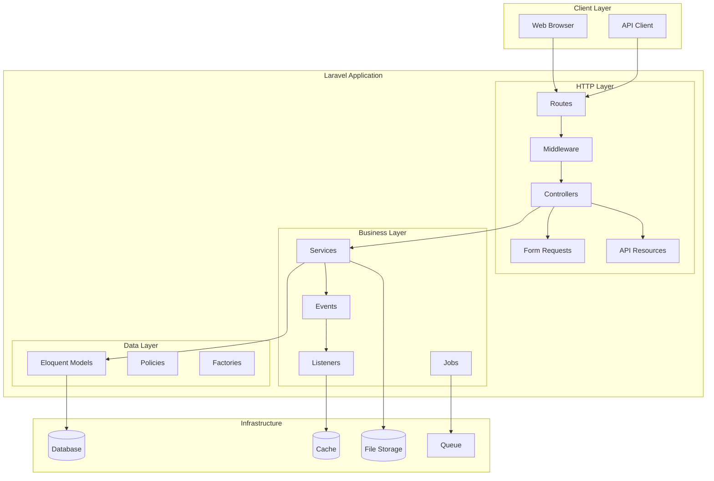
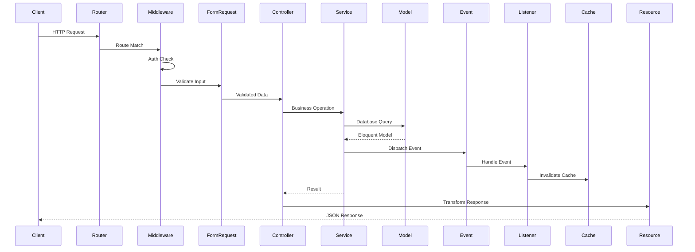
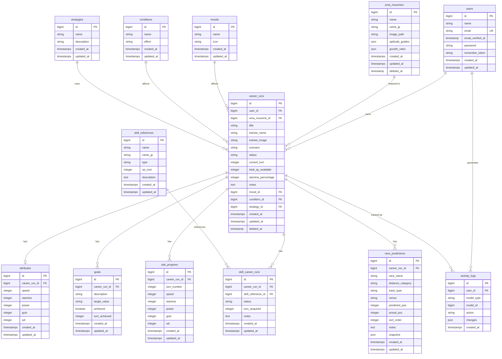

# Design Document

## Overview

This design document describes the backend architecture for the Uma Musume Planner application. The backend is built on Laravel 12+ and provides RESTful APIs, service layers, and database management for tracking Uma Musume training runs.

The architecture follows Laravel conventions with:

- Eloquent ORM for database operations
- Resource controllers for API endpoints
- Service classes for business logic
- Event-driven cache invalidation
- Form Request validation
- API Resources for response transformation

## Architecture

### High-Level Architecture



### Request Flow



## Components and Interfaces

### Controllers

#### PlanController (API V1)

```php
namespace App\Http\Controllers\Api\V1;

class PlanController extends Controller
{
    public function __construct(
        private PlanService $planService
    ) {}
    
    // GET /api/v1/plans
    public function index(Request $request): PlanCollection;
    
    // GET /api/v1/plans/{plan}
    public function show(Plan $plan): PlanResource;
    
    // POST /api/v1/plans
    public function store(StorePlanRequest $request): PlanResource;
    
    // PUT /api/v1/plans/{plan}
    public function update(UpdatePlanRequest $request, Plan $plan): PlanResource;
    
    // DELETE /api/v1/plans/{plan}
    public function destroy(Plan $plan): Response;
}
```

#### AutosuggestController

```php
namespace App\Http\Controllers\Api\V1;

class AutosuggestController extends Controller
{
    // GET /api/v1/autosuggest/skills?q={query}
    public function skills(Request $request): JsonResponse;
    
    // GET /api/v1/autosuggest/characters?q={query}
    public function characters(Request $request): JsonResponse;
}
```

### Services

#### PlanService

```php
namespace App\Services;

class PlanService
{
    public function __construct(
        private CacheService $cacheService
    ) {}
    
    // Create plan with related entities
    public function create(array $data, User $user): Plan;
    
    // Update plan and related entities
    public function update(Plan $plan, array $data): Plan;
    
    // Soft delete plan
    public function delete(Plan $plan): bool;
    
    // Get paginated plans for user
    public function getForUser(User $user, array $filters = []): LengthAwarePaginator;
    
    // Get plan with all relations
    public function getWithRelations(Plan $plan): Plan;
    
}
```

#### CacheService

```php
namespace App\Services;

class CacheService
{
    // Clear plan-related caches
    public function clearPlanCache(Plan $plan): void;
    
    // Clear user's plan list cache
    public function clearUserPlanListCache(User $user): void;
    
    // Cache skill search results
    public function cacheSkillSearch(string $query, array $results): void;
    
    // Get cached skill search results
    public function getSkillSearchCache(string $query): ?array;
}
```

#### ExportService

```php
namespace App\Services;

class ExportService
{
    // Export plan to Excel format
    public function toExcel(Plan $plan): string;
    
    // Export plan to CSV format
    public function toCsv(Plan $plan): string;
    
    // Export plan to Markdown format
    public function toMarkdown(Plan $plan): string;
    
    // Bulk export multiple plans
    public function bulkExport(Collection $plans, string $format): string;
}
```

#### ImportService

```php
namespace App\Services;

class ImportService
{
    // Detect format from uploaded file
    public function detectFormat(UploadedFile $file): string;
    
    // Validate import data (dry run)
    public function validate(array $data): ImportValidationResult;
    
    // Execute import into database
    public function import(array $data, User $user): ImportResult;
    
    // Generate error report
    public function generateErrorReport(ImportValidationResult $result): string;
}
```

### Form Requests

#### StorePlanRequest

```php
namespace App\Http\Requests;

class StorePlanRequest extends FormRequest
{
    public function rules(): array
    {
        return [
            'title' => 'required|string|max:255',
            'umamusume_id' => 'nullable|exists:umamusumes,id',
            'trainee_name' => 'nullable|string|max:255',
            'scenario' => 'nullable|string|in:URA,Aoharu,MakeANewTrack,GrandLive,LArc,UAF,CookGrandPrix',
            'status' => 'nullable|string|in:ongoing,finished,failed',
            'current_turn' => 'nullable|integer|min:1|max:78',
            'total_sp_available' => 'nullable|integer|min:0',
            'stamina_percentage' => 'nullable|integer|min:0|max:100',
            'notes' => 'nullable|string',
            'attributes' => 'nullable|array',
            'attributes.speed' => 'nullable|integer|min:0|max:1200', // Hard max at 1200
            'attributes.stamina' => 'nullable|integer|min:0|max:1200', // Hard max at 1200
            'attributes.power' => 'nullable|integer|min:0|max:1200', // Hard max at 1200
            'attributes.guts' => 'nullable|integer|min:0|max:1200', // Hard max at 1200
            'attributes.wit' => 'nullable|integer|min:0|max:1200', // Hard max at 1200
        ];
    }
}
```

#### UpdatePlanRequest

```php
namespace App\Http\Requests;

class UpdatePlanRequest extends FormRequest
{
    public function rules(): array
    {
        return [
            'title' => 'sometimes|string|max:255',
            'umamusume_id' => 'nullable|exists:umamusumes,id',
            'trainee_name' => 'nullable|string|max:255',
            'scenario' => 'nullable|string|in:URA,Aoharu,MakeANewTrack,GrandLive,LArc,UAF,CookGrandPrix',
            'status' => 'nullable|string|in:ongoing,finished,failed',
            'current_turn' => 'nullable|integer|min:1|max:78',
            'total_sp_available' => 'nullable|integer|min:0',
            'stamina_percentage' => 'nullable|integer|min:0|max:100',
            'notes' => 'nullable|string',
            'attributes' => 'nullable|array',
            'skills' => 'nullable|array',
            'goals' => 'nullable|array',
        ];
    }
}
```

### API Resources

#### PlanResource

```php
namespace App\Http\Resources\Api\V1;

class PlanResource extends JsonResource
{
    public function toArray(Request $request): array
    {
        return [
            'id' => $this->id,
            'title' => $this->title,
            'trainee_name' => $this->trainee_name,
            'scenario' => $this->scenario,
            'status' => $this->status,
            'current_turn' => $this->current_turn,
            'total_sp_available' => $this->total_sp_available,
            'stamina_percentage' => $this->stamina_percentage,
            'notes' => $this->notes,
            'created_at' => $this->created_at->toIso8601String(),
            'updated_at' => $this->updated_at->toIso8601String(),
            
            // Relations (when loaded)
            'umamusume' => new UmamusumeResource($this->whenLoaded('umamusume')),
            'attributes' => new AttributeResource($this->whenLoaded('attributes')),
            'skills' => SkillResource::collection($this->whenLoaded('skills')),
            'goals' => GoalResource::collection($this->whenLoaded('goals')),
            'turns' => TurnResource::collection($this->whenLoaded('turns')),
            'race_predictions' => RacePredictionResource::collection($this->whenLoaded('racePredictions')),
        ];
    }
}
```

#### PlanCollection

```php
namespace App\Http\Resources\Api\V1;

class PlanCollection extends ResourceCollection
{
    public function toArray(Request $request): array
    {
        return [
            'data' => $this->collection,
            'meta' => [
                'total' => $this->total(),
                'per_page' => $this->perPage(),
                'current_page' => $this->currentPage(),
                'last_page' => $this->lastPage(),
            ],
            'links' => [
                'first' => $this->url(1),
                'last' => $this->url($this->lastPage()),
                'prev' => $this->previousPageUrl(),
                'next' => $this->nextPageUrl(),
            ],
        ];
    }
}
```

### Events and Listeners

#### PlanCreated Event

```php
namespace App\Events;

class PlanCreated implements ShouldBroadcast
{
    public function __construct(
        public Plan $plan
    ) {}
}
```

#### PlanUpdated Event

```php
namespace App\Events;

class PlanUpdated implements ShouldBroadcast
{
    public function __construct(
        public Plan $plan
    ) {}
}
```

#### ClearPlanCache Listener

```php
namespace App\Listeners;

class ClearPlanCache
{
    public function __construct(
        private CacheService $cacheService
    ) {}
    
    public function handle(PlanCreated|PlanUpdated $event): void
    {
        $this->cacheService->clearPlanCache($event->plan);
        $this->cacheService->clearUserPlanListCache($event->plan->user);
    }
}
```

### Policies

#### PlanPolicy

```php
namespace App\Policies;

class PlanPolicy
{
    // User can view their own plans
    public function view(User $user, Plan $plan): bool
    {
        return $user->id === $plan->user_id;
    }
    
    // User can update their own plans
    public function update(User $user, Plan $plan): bool
    {
        return $user->id === $plan->user_id;
    }
    
    // User can delete their own plans
    public function delete(User $user, Plan $plan): bool
    {
        return $user->id === $plan->user_id;
    }
}
```

## Data Models

### Naming Convention Note

The database uses canonical domain names from the consolidation spec, while the API and Laravel models use user-friendly names. Each model explicitly sets `$table` to map to the canonical table name:

| Laravel Model | Database Table | API Route | Model Config |
|---------------|----------------|-----------|--------------|
| `Plan` | `career_runs` | `/api/v1/plans` | `$table = 'career_runs'` |
| `Turn` | `stat_progress` | - | `$table = 'stat_progress'` |
| `Skill` | `skill_career_runs` | - | `$table = 'skill_career_runs'` |

Foreign keys follow the pattern `{singular_table}_id` (e.g., `career_run_id`, not `plan_id`).

### Entity Relationship Diagram



### Model Definitions

#### Plan Model

```php
namespace App\Models;

class Plan extends Model
{
    use HasFactory, SoftDeletes;
    
    // Maps to canonical 'career_runs' table per consolidation spec
    protected $table = 'career_runs';
    
    protected $fillable = [
        'user_id',
        'umamusume_id',
        'title',
        'trainee_name',
        'trainee_image',
        'scenario',
        'status',
        'current_turn',
        'total_sp_available',
        'stamina_percentage',
        'notes',
        'mood_id',
        'condition_id',
        'strategy_id',
    ];
    
    protected $casts = [
        'current_turn' => 'integer',
        'total_sp_available' => 'integer',
        'stamina_percentage' => 'integer',
    ];
    
    // Relationships
    public function user(): BelongsTo;
    public function umamusume(): BelongsTo;
    public function attributes(): HasOne;
    public function skills(): HasMany;
    public function goals(): HasMany;
    public function turns(): HasMany;
    public function racePredictions(): HasMany;
    public function mood(): BelongsTo;
    public function condition(): BelongsTo;
    public function strategy(): BelongsTo;
    public function activityLogs(): MorphMany;
    
    // Scopes
    public function scopeForUser(Builder $query, User $user): Builder;
    public function scopeOngoing(Builder $query): Builder;
    public function scopeFinished(Builder $query): Builder;
}
```

#### Skill Model

```php
namespace App\Models;

class Skill extends Model
{
    use HasFactory;
    
    // Maps to canonical 'skill_career_runs' pivot table per consolidation spec
    protected $table = 'skill_career_runs';
    
    protected $fillable = [
        'career_run_id',  // FK to career_runs table
        'skill_reference_id',
        'status',
        'turn_acquired',
        'notes',
    ];
    
    protected $casts = [
        'turn_acquired' => 'integer',
    ];
    
    // Status constants
    const STATUS_ACQUIRED = 'acquired';
    const STATUS_SKIPPED = 'skipped';
    const STATUS_SUGGESTED = 'suggested';
    
    // Relationships
    public function careerRun(): BelongsTo;  // Alias: plan() for API compatibility
    public function skillReference(): BelongsTo;
    
    // Validation: turn_acquired required when status is acquired
    public static function boot()
    {
        parent::boot();
        
        static::saving(function ($skill) {
            if ($skill->status === self::STATUS_ACQUIRED && !$skill->turn_acquired) {
                throw new ValidationException('turn_acquired is required when status is acquired');
            }
        });
    }
}
```

### Database Indexes

```sql
-- career_runs table indexes (Plan model maps to this table)
CREATE INDEX career_runs_user_id_index ON career_runs(user_id);
CREATE INDEX career_runs_uma_musume_id_index ON career_runs(uma_musume_id);
CREATE INDEX career_runs_status_index ON career_runs(status);
CREATE INDEX career_runs_created_at_index ON career_runs(created_at);
CREATE INDEX career_runs_user_status_index ON career_runs(user_id, status);

-- skill_career_runs table indexes (Skill model maps to this table)
CREATE INDEX skill_career_runs_career_run_id_index ON skill_career_runs(career_run_id);
CREATE INDEX skill_career_runs_skill_reference_id_index ON skill_career_runs(skill_reference_id);
CREATE INDEX skill_career_runs_status_index ON skill_career_runs(status);

-- skill_references table indexes
CREATE INDEX skill_references_name_index ON skill_references(name);
CREATE INDEX skill_references_name_jp_index ON skill_references(name_jp);
CREATE FULLTEXT INDEX skill_references_search ON skill_references(name, name_jp);

-- stat_progress table indexes (Turn model maps to this table)
CREATE INDEX stat_progress_career_run_id_index ON stat_progress(career_run_id);
CREATE INDEX stat_progress_turn_number_index ON stat_progress(turn_number);
CREATE UNIQUE INDEX stat_progress_career_run_turn_unique ON stat_progress(career_run_id, turn_number);

-- activity_logs table indexes
CREATE INDEX activity_logs_user_id_index ON activity_logs(user_id);
CREATE INDEX activity_logs_model_index ON activity_logs(model_type, model_id);
CREATE INDEX activity_logs_created_at_index ON activity_logs(created_at);
```

## Correctness Properties

*A property is a characteristic or behavior that should hold true across all valid executions of a system—essentially, a formal statement about what the system should do. Properties serve as the bridge between human-readable specifications and machine-verifiable correctness guarantees.*

### Property 1: User Data Isolation

*For any* authenticated user and any plan in the system, the user SHALL only be able to access, modify, or delete plans where `plan.user_id` equals their own user ID. Attempting to access another user's plan SHALL result in a 403 Forbidden response.

**Validates: FR-BE-2.1, FR-BE-2.9, FR-BE-9.3, FR-BE-10.4**

### Property 2: Plan CRUD Round-Trip

*For any* valid plan data, creating a plan via POST, then retrieving it via GET, SHALL return data equivalent to the original input (with server-generated fields like `id`, `created_at` added). Similarly, updating a plan via PUT SHALL result in the retrieved plan reflecting all changes.

**Validates: FR-BE-2.2, FR-BE-2.5, FR-BE-2.6, FR-BE-3.1**

### Property 3: Soft Delete Behavior

*For any* plan that is deleted via the API, the plan SHALL have its `deleted_at` timestamp set (not null), SHALL NOT appear in list queries, but SHALL still exist in the database. Related entities (skills, goals, turns) SHALL also be soft-deleted.

**Validates: FR-BE-1.3, FR-BE-2.7, FR-BE-3.3**

### Property 4: Event-Driven Cache Invalidation

*For any* plan creation or update operation, the system SHALL dispatch the corresponding event (`PlanCreated` or `PlanUpdated`), and the cache listener SHALL invalidate the plan cache and user's plan list cache.

**Validates: FR-BE-3.4, FR-BE-3.5, FR-BE-8.1**

### Property 5: Search Behavior

*For any* search query string, the skill/character search SHALL return results where either the English name OR Japanese name contains the query (case-insensitive, partial match). Results SHALL be limited to 20 items maximum. An empty query or no matches SHALL return an empty array.

**Validates: FR-BE-4.2, FR-BE-4.3, FR-BE-4.4, FR-BE-5.2, FR-BE-5.3**

### Property 6: Export/Import Round-Trip

*For any* plan with complete data (attributes, skills, goals, turns, predictions), exporting to JSON and then importing SHALL produce a plan with equivalent data. The export SHALL include a `schema_version` field. This property also applies to CSV format for tabular data.

**Validates: FR-BE-6.1, FR-BE-6.2, FR-BE-6.4, FR-BE-7.2, FR-BE-7.3**

### Property 7: Import Validation

*For any* import data, dry-run validation SHALL report all errors without persisting any data. If validation fails, an error report SHALL be generated. Import results SHALL accurately report counts of created, updated, and skipped records matching actual database operations.

**Validates: FR-BE-7.4, FR-BE-7.6, FR-BE-7.7, FR-BE-7.8**

### Property 8: Duplicate Detection

*For any* import containing data that matches an existing plan (same title, character, and created date), the system SHALL detect and report the duplicate, allowing the user to choose how to proceed.

**Validates: FR-BE-7.6**

### Property 9: Activity Logging Completeness

*For any* plan create, update, or delete operation, an activity log entry SHALL be created with the correct action type, user ID, and timestamp. Update logs SHALL include the changed fields.

**Validates: FR-BE-10.1, FR-BE-10.2, FR-BE-10.3**

### Property 10: Stat Value Validation

*For any* stat entry (speed, stamina, power, guts, wit), values outside the range 0-1200 SHALL be rejected with a validation error (hard max). Stats SHALL be returned ordered by `turn_number` ascending.

**Validates: FR-BE-11.3, FR-BE-11.4, FR-BE-11.6**

### Property 11: Skill Status Validation

*For any* skill with status `acquired`, the `turn_acquired` field SHALL be required and non-null. Skills with status `skipped` or `suggested` MAY have null `turn_acquired`. The status field SHALL only accept values: `acquired`, `skipped`, `suggested`.

**Validates: FR-BE-12.1, FR-BE-12.2**

### Property 12: SP Calculation Accuracy

*For any* plan with skills, the acquired SP total SHALL equal the sum of `sp_cost` for all skills where `status = 'acquired'`. The suggested SP budget SHALL equal the sum of `sp_cost` for all skills where `status = 'suggested'`. These calculations SHALL be independent.

**Validates: FR-BE-12.3, FR-BE-12.4**

### Property 13: Image Validation

*For any* uploaded image file, the system SHALL reject files that are not jpg/png/webp, exceed 2MB, or have mismatched MIME type vs content. Valid images SHALL have EXIF metadata stripped and a thumbnail generated.

**Validates: FR-BE-15.1, FR-BE-15.2, FR-BE-15.3, FR-BE-15.4, FR-BE-15.5**

### Property 14: Snapshot Immutability

*For any* snapshot created from a plan's current state, the snapshot SHALL capture all stats, mood, conditions, skills, SP, and stamina. Once created, any attempt to update the snapshot SHALL be rejected. Snapshots SHALL be returned ordered by turn number and timestamp.

**Validates: FR-BE-16.1, FR-BE-16.2, FR-BE-16.3, FR-BE-16.5**

### Property 15: API Response Consistency

*For any* API response, list endpoints SHALL include pagination metadata (total, per_page, current_page, last_page). Error responses SHALL use consistent format with `message` and `errors` fields. All responses SHALL include `Content-Type: application/json` header.

**Validates: FR-BE-17.2, FR-BE-17.3, FR-BE-17.4, FR-BE-17.5**

### Property 16: Authentication Enforcement

*For any* request to a protected endpoint without valid authentication, the API SHALL return 401 Unauthorized. Validation errors SHALL return 422 Unprocessable Entity with field-level error details.

**Validates: FR-BE-2.8, FR-BE-2.10**

## Error Handling

### API Error Responses

All API errors follow a consistent format:

```json
{
    "message": "Human-readable error message",
    "errors": {
        "field_name": ["Validation error 1", "Validation error 2"]
    }
}
```

### HTTP Status Codes

| Code | Meaning | Usage |
|------|---------|-------|
| 200 | OK | Successful GET, PUT |
| 201 | Created | Successful POST |
| 204 | No Content | Successful DELETE |
| 400 | Bad Request | Malformed request |
| 401 | Unauthorized | Missing/invalid authentication |
| 403 | Forbidden | Authenticated but not authorized |
| 404 | Not Found | Resource doesn't exist |
| 422 | Unprocessable Entity | Validation failed |
| 429 | Too Many Requests | Rate limit exceeded |
| 500 | Internal Server Error | Unexpected server error |

### Exception Handling

```php
// app/Exceptions/ApiException.php
class ApiException extends Exception
{
    public function __construct(
        string $message,
        public int $statusCode = 400,
        public array $errors = []
    ) {
        parent::__construct($message);
    }
    
    public function render(): JsonResponse
    {
        return response()->json([
            'message' => $this->message,
            'errors' => $this->errors,
        ], $this->statusCode);
    }
}
```

### Validation Error Handling

Form Request validation automatically returns 422 with field-level errors:

```php
// Automatic response from FormRequest validation failure
{
    "message": "The given data was invalid.",
    "errors": {
        "title": ["The title field is required."],
        "current_turn": ["The current turn must be between 1 and 78."]
    }
}
```

### Database Transaction Handling

```php
// Service layer transaction handling
public function create(array $data, User $user): Plan
{
    return DB::transaction(function () use ($data, $user) {
        $plan = Plan::create([...$data, 'user_id' => $user->id]);
        
        if (isset($data['attributes'])) {
            $plan->attributes()->create($data['attributes']);
        }
        
        if (isset($data['skills'])) {
            foreach ($data['skills'] as $skill) {
                $plan->skills()->create($skill);
            }
        }
        
        event(new PlanCreated($plan));
        
        return $plan;
    });
}
```

## Testing Strategy

### Dual Testing Approach

This project uses both unit tests and property-based tests for comprehensive coverage:

- **Unit tests**: Verify specific examples, edge cases, and error conditions
- **Property tests**: Verify universal properties across all valid inputs

### Testing Framework

- **PHPUnit**: Primary testing framework for Laravel
- **Pest PHP**: Optional BDD-style syntax (already in project)
- **PHPUnit Quickcheck** or **Eris**: Property-based testing library for PHP

### Property-Based Testing Configuration

Each property test MUST:

- Run minimum 100 iterations
- Reference the design document property number
- Use tag format: `Feature: umamusume-planner-backend, Property {number}: {property_text}`

### Test Organization

```
tests/
├── Feature/
│   ├── Api/
│   │   └── V1/
│   │       ├── PlanControllerTest.php
│   │       ├── AutosuggestControllerTest.php
│   │       └── Properties/
│   │           ├── UserDataIsolationPropertyTest.php
│   │           ├── PlanCrudRoundTripPropertyTest.php
│   │           ├── SearchBehaviorPropertyTest.php
│   │           └── ...
│   └── Services/
│       ├── PlanServiceTest.php
│       ├── ExportServiceTest.php
│       ├── ImportServiceTest.php
│       └── Properties/
│           ├── ExportImportRoundTripPropertyTest.php
│           ├── SpCalculationPropertyTest.php
│           └── ...
├── Unit/
│   ├── Models/
│   │   ├── PlanTest.php
│   │   ├── SkillTest.php
│   │   └── ...
│   └── Validation/
│       ├── StatValidationTest.php
│       ├── ImageValidationTest.php
│       └── ...
└── TestCase.php
```

### Example Property Test

```php
// tests/Feature/Api/V1/Properties/UserDataIsolationPropertyTest.php

use Eris\Generator;
use Eris\TestTrait;

/**
 * Feature: umamusume-planner-backend, Property 1: User Data Isolation
 * 
 * For any authenticated user and any plan in the system, the user SHALL only
 * be able to access plans where plan.user_id equals their own user ID.
 * 
 * Validates: Requirements 2.1, 2.7, 9.3, 10.4
 */
class UserDataIsolationPropertyTest extends TestCase
{
    use TestTrait;
    
    public function test_user_can_only_access_own_plans(): void
    {
        $this->forAll(
            Generator\tuple(
                Generator\elements(User::factory()->count(5)->create()->all()),
                Generator\elements(User::factory()->count(5)->create()->all())
            )
        )
        ->withMaxSize(100)
        ->then(function ($users) {
            [$owner, $otherUser] = $users;
            
            $plan = Plan::factory()->for($owner)->create();
            
            // Owner can access
            $this->actingAs($owner)
                ->getJson("/api/v1/plans/{$plan->id}")
                ->assertOk();
            
            // Other user cannot access
            if ($owner->id !== $otherUser->id) {
                $this->actingAs($otherUser)
                    ->getJson("/api/v1/plans/{$plan->id}")
                    ->assertForbidden();
            }
        });
    }
}
```

### Example Unit Test

```php
// tests/Unit/Models/SkillTest.php

class SkillTest extends TestCase
{
    public function test_acquired_skill_requires_turn_acquired(): void
    {
        $plan = Plan::factory()->create();
        
        $this->expectException(ValidationException::class);
        
        Skill::create([
            'career_run_id' => $plan->id,
            'skill_reference_id' => SkillReference::factory()->create()->id,
            'status' => 'acquired',
            'turn_acquired' => null, // Should fail
        ]);
    }
    
    public function test_suggested_skill_allows_null_turn_acquired(): void
    {
        $plan = Plan::factory()->create();
        
        $skill = Skill::create([
            'career_run_id' => $plan->id,
            'skill_reference_id' => SkillReference::factory()->create()->id,
            'status' => 'suggested',
            'turn_acquired' => null,
        ]);
        
        $this->assertNotNull($skill->id);
    }
}
```

### Test Data Generators

```php
// tests/Generators/PlanGenerator.php

class PlanGenerator
{
    public static function validPlanData(): array
    {
        return [
            'title' => fake()->sentence(3),
            'trainee_name' => fake()->name(),
            'scenario' => fake()->randomElement(['URA', 'Aoharu', 'GrandLive']),
            'status' => fake()->randomElement(['ongoing', 'finished', 'failed']),
            'current_turn' => fake()->numberBetween(1, 78),
            'total_sp_available' => fake()->numberBetween(0, 5000),
            'stamina_percentage' => fake()->numberBetween(0, 100),
        ];
    }
    
    public static function validStatData(): array
    {
        return [
            'speed' => fake()->numberBetween(0, 2000),
            'stamina' => fake()->numberBetween(0, 2000),
            'power' => fake()->numberBetween(0, 2000),
            'guts' => fake()->numberBetween(0, 2000),
            'wit' => fake()->numberBetween(0, 2000),
        ];
    }
    
    public static function invalidStatData(): array
    {
        return [
            'speed' => fake()->numberBetween(2001, 9999), // Invalid
            'stamina' => fake()->numberBetween(0, 2000),
            'power' => fake()->numberBetween(0, 2000),
            'guts' => fake()->numberBetween(0, 2000),
            'wit' => fake()->numberBetween(0, 2000),
        ];
    }
}
```

### Coverage Requirements

- Minimum 80% code coverage
- All properties must have corresponding property tests
- All API endpoints must have feature tests
- All models must have unit tests for validation rules
- All services must have unit tests for business logic
