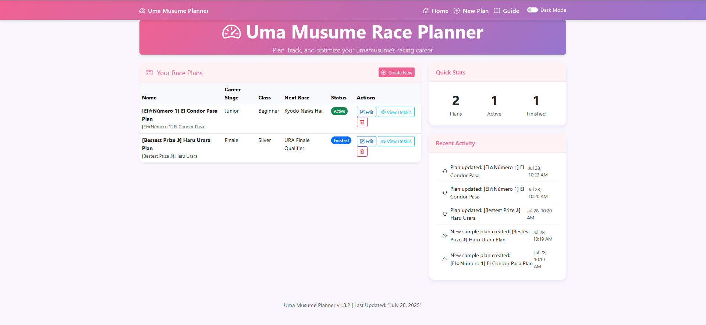
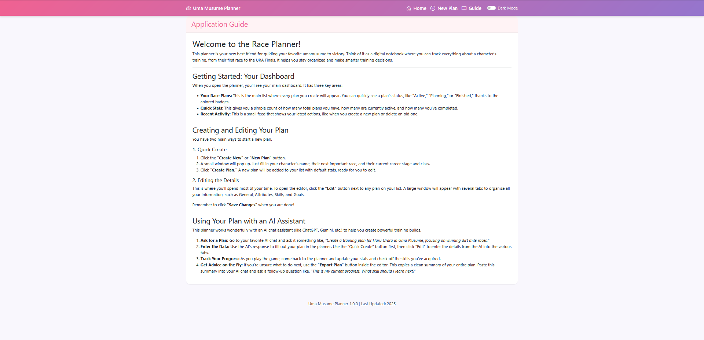

# 🐎 Uma Musume Race Planner (Laravel Edition)

A lightweight Laravel web application for planning and tracking turn-based training strategies, stat development, skill acquisition, and race goals inspired by Uma Musume. Built for fast manual data entry with autosuggestions, clean interfaces, and no login — ideal for offline strategy planners.

---

## Application Preview

### Application Screenshots (v1.3.2)

_Note: These screenshots showcase the core interface. The latest version (v1.4.0) adds the new Trainee Image and Progress Chart features._

|                    Light Mode Dashboard                     |                             Dark Mode Dashboard                             |
| :---------------------------------------------------------: | :-------------------------------------------------------------------------: |
|          |  |
|                   **Quick Create Modal**                    |                              **In-App Guide**                               |
|  |                           |

**Plan Editor Tabs:**

|                                      General                                      |                                              Attributes                                               |                                           Aptitude Grades                                           |
| :-------------------------------------------------------------------------------: | :---------------------------------------------------------------------------------------------------: | :-------------------------------------------------------------------------------------------------: |
|  |                |  |
|                                    **Skills**                                     |                                         **Race Predictions**                                          |                                              **Goals**                                              |
|    |  |                        |

---

## ✨ Features

## Visual Enhancements (New in v1.4.0)

- **Trainee Image Management:** Personalize each plan by uploading a trainee image, which appears in the editor and as a thumbnail on the main dashboard.
- **Stat Progression Chart:** A new "Progress Chart" tab in the editor provides a line graph visualizing the trainee's stat growth.
- **Dynamic Theming:** The application's primary accent color is now configurable via the `.env` file.

## Core Functionality

- **Detailed Plan Management:** Create, view, update, and delete comprehensive training plans.
- **Two Editing Views:** A full-screen **Details Modal** for in-depth editing and an **Inline Details Panel** for quick access.
- **Dynamic Dashboard:** Includes panels for quick stats and a log of recent activity.

## Utility & UX

- **Quick Create Modal:** Quickly start a new plan with essential details.
- **Dark Mode:** A theme toggle for user comfort.
- **Plain Text Export:** A "Copy to Clipboard" feature generates a clean summary of any plan, perfect for sharing.
- **Active Navbar Links:** The navbar now highlights the active page for better navigation.

---

## 🖥️ Tech Stack

- **Frontend**: Blade, Livewire, Tailwind CSS, Bootstrap 5, Vanilla JavaScript
- **Backend**: PHP 8.2+, Laravel 12, Composer
- **Database**: MySQL / MariaDB

---

## 🚀 Getting Started

### Prerequisites

- A local web server environment (e.g., XAMPP, WAMP, MAMP).
- PHP 8.2 or higher.
- MySQL or MariaDB database server.
- [Composer](https://getcomposer.org/) for managing PHP dependencies.

### 1. Clone the Repository

```bash
git clone https://github.com/IzzatFirdaus/uma_musume_race_planner.git
cd uma_musume_race_planner
```

### 2. Install Dependencies

```bash
composer install
npm install
npm run build
```

### 3. Database Setup

1. **Create the Database:** Using a tool like phpMyAdmin, create a new database. The default name is `uma_musume_planner`.
2. **Import the Schema:** Import the database structure by executing the `uma_musume_planner.sql` file. This will create all the necessary tables.
3. **(Optional) Seed Data:** You can optionally import `sample_data.sql` for demo data.

### 4. Environment Configuration

1. In the root directory, create a file named `.env`.
2. Copy the following configuration, adjusting the database credentials to match your local setup.

```ini
# .env - Local Development Configuration

# Database Configuration
DB_HOST=localhost
DB_DATABASE=uma_musume_planner
DB_USERNAME=root
DB_PASSWORD=

# Application Metadata & Theming
APP_VERSION=v1.4.0
APP_THEME_COLOR=#7d2b8b
LAST_UPDATED="July 29, 2025"
```

### 5. Running the Application

Place the project folder inside your web server's root directory (e.g., `C:/xampp/htdocs/`) and navigate to it in your browser (e.g., `http://localhost/uma-musume-planner-laravel/`).

---

## 📁 Folder Structure

```bash
uma-musume-planner-laravel/
├── app/
├── bootstrap/
├── config/
├── database/
├── public/
│   └── uploads/
│       ├── app_bg/
│       ├── trainee_images/
│       └── screenshot/
├── resources/
│   ├── assets/
│   ├── css/
│   ├── js/
│   └── views/
├── routes/
├── storage/
├── tests/
├── vendor/
├── .env
├── composer.json
├── uma_musume_planner.sql
├── sample_data.sql
├── README.md
└── ...
```

---

## 🗃️ Database Overview

- `plans`: The core table storing general plan info, including the `trainee_image_path`.
- `attributes`: Stores the five core stats for each plan.
- `skills`, `goals`, `race_predictions`: Child tables for detailed tracking.
- `terrain_grades`, `distance_grades`, `style_grades`: Aptitude grades.
- `turns`: Stores turn-by-turn stat progression for the Progress Chart.
- `activity_log`: Tracks recent user actions.

---

## Safari/iOS CSS Compatibility

This project uses visual effects with `backdrop-filter` in `resources/css/style.css`. For compatibility with Safari and iOS browsers, the vendor-prefixed property `-webkit-backdrop-filter` is included alongside the standard property. If you add new CSS rules using `backdrop-filter`, always add the prefixed version for full browser support.

**Reference:** [MDN Docs: backdrop-filter](https://developer.mozilla.org/en-US/docs/Web/CSS/backdrop-filter)

---

## 📌 Notes

- ✅ Built for single-user, local/offline use
- 🔒 No authentication required
- 🐣 Inspired by Uma Musume: Pretty Derby
- 🧪 Ideal for simulation planning and strategy testing

## Repo scan (automated)

This section was generated automatically from a quick repository scan and summarizes the runtime and key package information detected in this project.

- PHP: 8.2.12
- Laravel: 12.21.0
- Database engine: mysql
- Key packages and versions:

- laravel/framework: 12.21.0
- livewire/livewire: 3.6.4
- larastan/larastan: 3.6.1
- laravel/pint: 1.24.0
- laravel/sail: 1.44.0
- phpunit/phpunit: 11.5.28
- tailwindcss: 4.1.11

- Eloquent models detected: (none reported by scanner)

Verification:

- Source: automated Laravel Boost `application-info` scan.
- To reproduce locally, run the following in PowerShell:

```powershell
php -v
php artisan --version
composer show --installed
```

Recommended quick checks and commands:

```powershell
# Install dependencies
composer install; npm install

# Build frontend assets (if making frontend changes)
npm run build

# Run Laravel Pint formatter (project includes Laravel Pint)
php vendor/bin/pint --dirty

# Run tests
php artisan test
```

If you'd like, I can expand this section to include route lists, database schema excerpts, or test run output.

## 🧩 To-Do

- [x] Autosuggest skills, races, names
- [x] Soft-delete support
- [x] Export plans as formatted text
- [x] Stat progression chart
- [ ] Optional login & cloud sync support
- [ ] Advanced search/filtering (by stats, skills, etc.)

---

## 📜 License

MIT License © 2025

---

## About Laravel

This project is built with [Laravel](https://laravel.com/), a modern PHP web application framework. For more information, see the [Laravel documentation](https://laravel.com/docs).
