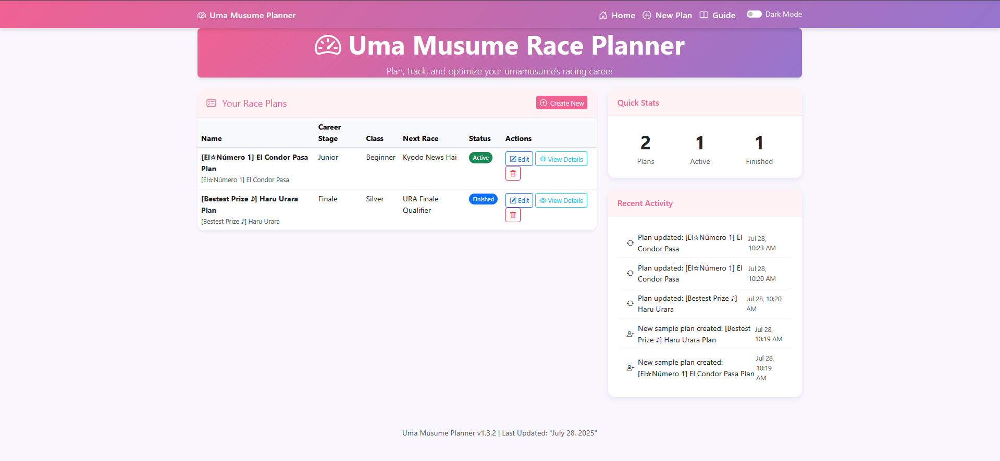
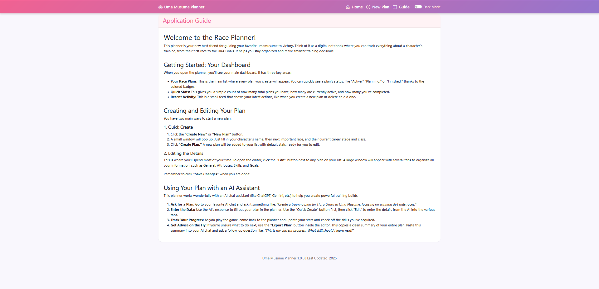

# 🐎 Uma Musume Race Planner

A lightweight PHP + MySQL web application for planning and tracking turn-based training strategies, stat development, skill acquisition, and race goals inspired by Uma Musume. Built for fast manual data entry with autosuggestions, clean interfaces, and no login — ideal for offline strategy planners.

---

## Application Preview

### Application Screenshots (v1.3.2)

_Note: These screenshots showcase the core interface. The latest version (v1.4.0) adds the new Trainee Image and Progress Chart features._

|             Light Mode Dashboard             |                     Dark Mode Dashboard                      |
| :------------------------------------------: | :----------------------------------------------------------: |
|          |  |
|            **Quick Create Modal**            |                       **In-App Guide**                       |
|  |                           |

**Plan Editor Tabs:**

|                              General                               |                                       Attributes                                       |                                   Aptitude Grades                                    |
| :----------------------------------------------------------------: | :------------------------------------------------------------------------------------: | :----------------------------------------------------------------------------------: |
|  |                |  |
|                             **Skills**                             |                                  **Race Predictions**                                  |                                      **Goals**                                       |
|    |  |                        |

</details>
---

## ✨ Features

- **Visual Enhancements (New in v1.4.0)**
  - **Trainee Image Management:** Personalize each plan by uploading a trainee image, which appears in the editor and as a thumbnail on the main dashboard.
  - **Stat Progression Chart:** A new "Progress Chart" tab in the editor provides a line graph visualizing the trainee's stat growth.
  - **Dynamic Theming:** The application's primary accent color is now configurable via the `.env` file.
- **Core Functionality**
  - **Detailed Plan Management:** Create, view, update, and delete comprehensive training plans.
  - **Two Editing Views:** A full-screen **Details Modal** for in-depth editing and an **Inline Details Panel** for quick access.
  - **Dynamic Dashboard:** Includes panels for quick stats and a log of recent activity.
- **Utility & UX**
  - **Quick Create Modal:** Quickly start a new plan with essential details.
  - **Dark Mode:** A theme toggle for user comfort.
  - **Plain Text Export:** A "Copy to Clipboard" feature generates a clean summary of any plan, perfect for sharing.
  - **Active Navbar Links:** The navbar now highlights the active page for better navigation.

---

## 🖥️ Tech Stack

- **Frontend**: HTML, CSS (Bootstrap 5), Vanilla JavaScript
- **Backend**: PHP 8.0+, Composer
- **Database**: MySQL / MariaDB

---

## 🚀 Getting Started

### Prerequisites

- A local web server environment (e.g., XAMPP, WAMP, MAMP).
- PHP 8.0 or higher.
- MySQL or MariaDB database server.
- [Composer](https://getcomposer.org/) for managing PHP dependencies.

### 1. Clone the Repository

```bash
git clone [https://github.com/IzzatFirdaus/uma_musume_race_planner.git](https://github.com/IzzatFirdaus/uma_musume_race_planner.git)
cd uma_musume_race_planner
```bash

### 2\. Install Dependencies

The project uses Monolog for logging. Install it using Composer.

```bash
composer install
```

### 3\. Database Setup

1. **Create the Database:** Using a tool like phpMyAdmin, create a new database. The default name is `uma_musume_planner`.

2. **Import the Schema:** Import the database structure by executing the `uma_musume_planner.sql` file. This will create all the necessary tables.

### 4\. Environment Configuration

1. In the root directory, create a file named `.env`.

2. Copy the following configuration, adjusting the database credentials to match your local setup.

    ```ini
    # .env - Local Development Configuration

    # Database Configuration
    DB_HOST=localhost
    DB_NAME=uma_musume_planner
    DB_USER=root
    DB_PASS=

    # Application Metadata & Theming
    APP_VERSION=v1.4.0
    APP_THEME_COLOR=#7d2b8b
    LAST_UPDATED="July 29, 2025"
    ```

### 5\. Running the Application

Place the project folder inside your web server's root directory (e.g., `C:/xampp/htdocs/`) and navigate to it in your browser (e.g., `http://localhost/uma_musume_race_planner/`).

---

## 📁 Folder Structure

```bash
uma_musume_race_planner/
│
├── .vscode/                  # VS Code editor settings & tasks
├── components/               # Reusable UI partials (navbar, footer, plan list, etc.)
├── css/                      # Main application stylesheet (style.css)
├── includes/                 # Core backend scripts (DB connection, logger)
├── js/                       # Client-side JavaScript utilities (e.g., autosuggest.js)
├── screenshot/               # Application screenshots for documentation
├── uploads/                  # Directory for user-uploaded content
│   └── trainee_images/       # Stores uploaded trainee images
├── vendor/                   # Composer-managed PHP dependencies
│
├── index.php                 # Main application entry point and dashboard UI
├── guide.php                 # The in-app user guide page
├── handle_plan_crud.php      # Primary API endpoint for Create, Update, & Delete operations
│
├── get_*.php                 # Various API endpoints for fetching data (e.g., get_plans.php)
├── plan_details_modal.php    # UI for the full-screen plan editor
├── quick_create_plan_modal.php # UI for the quick create plan modal
│
├── .env                      # Environment configuration (DB credentials, app settings)
├── composer.json             # PHP project dependencies
├── uma_musume_planner.sql    # The complete database schema
├── sample_data.sql           # Optional data for populating the database
│
├── ARCHITECTURE_SPEC.md      # Technical documentation for the application's design
├── DIRECTORY.md              # Auto-generated detailed file and directory listing
├── README.md                 # This file
└── ...                       # Other development and config files (.gitignore, phpcs.xml, etc.)
```

---

## 🗃️ Database Overview

- `plans`: The core table storing general plan info, including the `trainee_image_path`.
- `attributes`: Stores the five core stats for each plan.
- `skills`, `goals`, `race_predictions`: Child tables for detailed tracking.
- `terrain_grades`, `distance_grades`, `style_grades`: Aptitude grades.
- `turns`: Stores turn-by-turn stat progression for the Progress Chart.
- `activity_log`: Tracks recent user actions.

---

## 📌 Notes

- ✅ Built for single-user, local/offline use
- 🔒 No authentication required
- 🐣 Inspired by Uma Musume: Pretty Derby
- 🧪 Ideal for simulation planning and strategy testing

---

## 🧩 To-Do

- [x] Autosuggest skills, races, names
- [x] Soft-delete support
- [x] Export plans as formatted text
- [x] Stat progression chart
- [ ] Optional login & cloud sync support
- [ ] Advanced search/filtering (by stats, skills, etc.)

---

## 📜 License

MIT License © 2025
