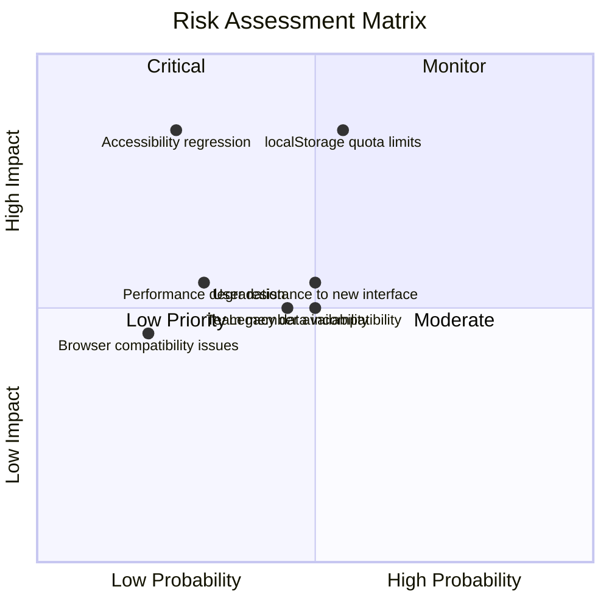
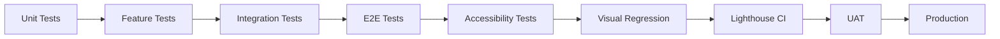

# D01 - System Development Plan

## Uma Musume Career Planner

Document Version: 3.0
Date: 2026-07-03
Status: In Progress

## Table of Contents

- [1. Executive Summary](#1-executive-summary)
- [2. Project Scope](#2-project-scope)
- [3. Technology Stack](#3-technology-stack)
- [4. Development Environment Setup](#4-development-environment-setup)
- [5. Development Phases](#5-development-phases)
- [6. Timeline and Dependency Plan](#6-timeline-and-dependency-plan)
- [7. Team Structure and Responsibilities](#7-team-structure-and-responsibilities)
- [8. Development Standards](#8-development-standards)
- [9. Risk Management](#9-risk-management)
- [10. Quality Assurance](#10-quality-assurance)
- [11. Deployment Strategy](#11-deployment-strategy)
- [12. Success Criteria](#12-success-criteria)
- [13. Assumptions and Constraints](#13-assumptions-and-constraints)
- [14. Change Management](#14-change-management)
- [15. Appendices](#15-appendices)

## 1. Executive Summary

This System Development Plan describes the work required to consolidate five legacy Uma Musume tracking applications into a unified platform called the Uma Musume Career Planner. The system enables players of Uma Musume: Pretty Derby to plan, manage, review, and analyze their CareerRun progression in a modern web application built on Laravel 12, Livewire 3, Alpine.js, and Tailwind CSS v4.

Target users are Uma Musume: Pretty Derby players who want to plan and review their character training runs.

### 1.1 Project Objectives

- Consolidate features from five legacy applications into a single platform.
- Preserve the canonical domain model centered on CareerRun, Character, Stat, Skill, and related planning entities.
- Support dual storage modes for local browser runs and account-backed runs.
- Achieve WCAG 2.1 AA accessibility compliance.
- Deliver a responsive, mobile-first interface with dark mode support and reduced-motion handling.
- Provide reliable import/export workflows for legacy and current data formats.

### 1.2 Source Applications

The consolidation scope covers the five legacy applications below.

| Application | Stack | Key Notes |
| --- | --- | --- |
| uma_musume_race_planner | PHP + MySQL + Bootstrap | Most feature-complete legacy implementation |
| umamusume-tracker | Laravel 12 + React | Strong API structure |
| uma-tracker | Laravel 11 + Blade | Closest to the target stack |
| uma-run-tracker | Static HTML + JavaScript | Strong accessibility baseline |
| uma-tracker-form | Native PHP + MVC | Simplest legacy workflow |

The current repository is the target implementation that absorbs and standardizes these legacy behaviors.

## 2. Project Scope

### 2.1 MVP Scope (Requirements 1-79)

The MVP includes all requirements numbered 1-79 from the Business Requirements Specification (BRS). See [D02 - Business Requirements Specifications](../docs/D02_Business_Requirements_Specifications.md) for the source requirement set and [Appendix 15.4](#154-feature-to-requirement-traceability-matrix-placeholder) for the traceability placeholder.

MVP deliverables include:

- Dual storage support for local and account-backed CareerRun data.
- CareerRun CRUD, editing, and validation flows.
- Character management and selection.
- Stat, aptitude, goal, race, and skill editing workflows.
- Import and export adapters for supported legacy formats.
- Accessibility and keyboard-navigation compliance for core flows.
- Playwright-based E2E coverage for critical user journeys.

### 2.2 Post-MVP Scope (P2/P3)

Post-MVP work covers requirements 80-87 and related enhancements that are useful but not required for launch.

- Optional authentication and cloud synchronization.
- Scheduled backups and restore tooling.
- Skill presets and quality-of-life helpers.
- Visual regression testing expansion.
- Event logging and metrics instrumentation.
- Demo mode and scenario-specific support such as Champions Meeting.

### 2.3 Must-have vs Nice-to-have Matrix

| Area | MVP Must-have | Post-MVP Nice-to-have | Notes |
| --- | --- | --- | --- |
| Storage | Dual storage support for local and account-backed CareerRun data | IndexedDB migration through localforage | localStorage is accepted for MVP only |
| CareerRun editing | CRUD, validation, save/load, delete | Inline optimization and workflow shortcuts | Core user journey |
| Character management | Character selection and metadata | Extended search and presets | Required for plan setup |
| Stats | Stat entry, turn tracking, visualization | Advanced charting and analytics | Must support canonical stat names |
| Skills | Skill autocomplete and status tracking | Skill presets and bulk editing | Skill autocomplete already exists in develop |
| Import/export | Supported legacy adapters and previews | Additional formats and automation | Import/export adapters are already in progress or done |
| Accessibility | Keyboard support, labels, contrast, focus states | Extended audit automation | WCAG 2.1 AA required |
| Testing | Unit, feature, E2E, accessibility | Visual regression expansion, performance baselines | Coverage target is 90%+ |

## 3. Technology Stack

### 3.1 Backend

| Component | Technology | Version / Notes |
| --- | --- | --- |
| Framework | Laravel | 12.x |
| Frontend Reactivity | Livewire | v3 for server-driven components |
| PHP | PHP | 8.4.11 |
| Database | MySQL / MariaDB / SQLite | Environment dependent |

### 3.2 Frontend

| Component | Technology | Version / Notes |
| --- | --- | --- |
| Client Interactivity | Alpine.js | Latest stable |
| Styling | Tailwind CSS | v4.0.x |
| Build Tool | Vite | Latest stable |

### 3.3 Testing

| Type | Tool | Notes |
| --- | --- | --- |
| Backend Unit / Feature | PHPUnit | Repository standard |
| JavaScript Unit | Jest | Standardized frontend unit test tool |
| E2E | Playwright | Critical-path coverage |
| Accessibility | axe-core | CI and local audit support |

### 3.4 Storage

| Mode | Technology | Notes |
| --- | --- | --- |
| Local Runs (MVP) | localStorage | Accepted for launch only |
| Local Runs (Post-MVP target) | IndexedDB via localforage | Required because localStorage has size limits |
| Account Runs | MySQL / MariaDB / SQLite | Persistent server-backed storage |

## 4. Development Environment Setup

Follow the repository installation steps in [README.md](../README.md#installation) for the current local setup process. The short version is:

1. Install PHP dependencies with Composer.
2. Copy `.env.example` to `.env` and configure the app key, database, and storage mode.
3. Run migrations and seeders.
4. Install JavaScript dependencies with npm.
5. Start the PHP backend and the Vite development server.

Recommended local values:

- `APP_ENV=local`
- `APP_DEBUG=true`
- `STORAGE_MODE=local` for browser-backed development, or `account` for database-backed runs
- A SQLite database is acceptable for quick local setup

If the repository README and environment files differ, the README installation section should be treated as the source of truth.

## 5. Development Phases

### Phase 1: Foundation (Week 1-2) - Status: In Progress

Objectives:

- Establish the data model, shared enums, and canonical naming conventions.
- Align the development environment and migration strategy before feature implementation expands.

Checklist:

- [Done] Database schema consolidation.
- [In Progress] Environment setup and configuration for `.env`, Vite, and Tailwind.
- [In Progress] Data migration plan implementation for legacy adapters.
- [In Progress] Eloquent models and relationships for core planning entities.
- [Done] Shared enums and constants for canonical domain values.

### Phase 2: Service Layer (Week 2-3) - Status: In Progress

Objectives:

- Build the business logic services that power CareerRun editing, stat handling, skill handling, and storage behavior.

Checklist:

- [In Progress] CareerRunService for CareerRun orchestration and validation.
- [In Progress] StatService for turn-based stat mutations and normalization.
- [In Progress] SkillService for skill acquisition, suggestion, and status handling.
- [Done] Storage abstraction layer for local and account-backed modes.
- [Done] Import/export adapters for supported legacy formats.
- [In Progress] LocalRunStorageService for browser-based persistence.
- [In Progress] Account storage bridge for authenticated persistence.
- [In Progress] Optional authentication and local-to-account conversion flow.

### Phase 3: Livewire Components (Week 3-5) - Status: In Progress

Objectives:

- Deliver the server-driven UI components for the main CareerRun experience.
- Keep the UI accessible while supporting inline and fullscreen editing modes.

Checklist:

- [Done] Dashboard component.
- [Done] CharacterList component.
- [In Progress] CareerRunForm component.
- [In Progress] StatChart component.
- [Done] SkillAutocomplete component.
- [In Progress] Dual editing modes (inline and fullscreen).
- [In Progress] Race prediction and goal editing components.
- [In Progress] Export / import interface components.

### Phase 4: Blade Components (Week 4-5) - Status: Planned

Objectives:

- Create reusable Blade components for forms, layout, and shared UI primitives.

Checklist:

- [Planned] Form fields and field groups.
- [Planned] Stat display and visualization helpers.
- [Planned] Layout shells and shared navigation.
- [Planned] Error, empty-state, and confirmation components.

### Phase 5: UI / UX Polish (Week 5-6) - Status: Planned

Objectives:

- Polish the interface for accessibility, motion, and responsive behavior.

Checklist:

- [Planned] Accessibility audit across the primary user flows.
- [Planned] Animation and micro-interactions with reduced motion support.
- [Planned] Dark mode and theme refinement.
- [Planned] Responsive review for 320px-2560px breakpoints.
- [Planned] Keyboard navigation and focus-state validation.

### Phase 6: API Layer (Week 6-7) - Optional / Post-MVP

Objectives:

- Provide a REST API only if the post-MVP roadmap requires it.

Checklist:

- [Optional] RESTful API endpoints.
- [Optional] API authentication and authorization.
- [Optional] API documentation and versioning.

### Phase 7: Testing (Week 7-8) - Status: In Progress

Objectives:

- Complete the automated test suite and validate the release with quality gates.

Checklist:

- [In Progress] Unit tests for domain services.
- [In Progress] Feature tests for major controller and Livewire flows.
- [In Progress] Test data seeding for repeatable test fixtures.
- [In Progress] Playwright E2E coverage for critical user journeys.
- [In Progress] Continuous accessibility testing with axe-core in CI.
- [Planned] Visual regression testing for key pages.
- [Planned] Performance and load testing for core flows.
- [Planned] Coverage validation at 90%+.

### Phase 8: Documentation and Deployment (Week 8-9) - Status: Planned

Objectives:

- Finalize documentation, deployment readiness, and the one-week delivery buffer.

Checklist:

- [Planned] Deployment checklist completion.
- [Planned] User manual and operator notes.
- [Planned] Data migration execution and verification.
- [Planned] Release buffer for unresolved defects and stabilization.

## 6. Timeline and Dependency Plan

### 6.1 Nine-Week Timeline

| Week | Focus |
| --- | --- |
| Week 1 | Foundation kickoff, environment setup, schema consolidation |
| Week 2 | Foundation completion and migration planning |
| Week 3 | Service layer buildout and storage abstraction |
| Week 4 | Livewire core components and CareerRun workflows |
| Week 5 | Livewire completion and Blade component scaffolding |
| Week 6 | UI / UX polish and accessibility refinement |
| Week 7 | Testing expansion, performance checks, optional API work begins |
| Week 8 | Test hardening, deployment readiness, documentation completion |
| Week 9 | Buffer week for fixes, stabilization, and release support |

### 6.2 Dependency Graph

```text
Phase 1 -> Phase 2 -> Phase 3 -> Phase 4 -> Phase 5 -> Phase 7 -> Phase 8
                     \-> Phase 6 (optional / post-MVP)

Phase 8 includes Week 9 as a buffer for defect fixes and release stabilization.
```

### 6.3 Mermaid Gantt Chart

```mermaid
gantt
    title Uma Musume Career Planner Development Timeline
    dateFormat  X
    axisFormat  Week %W
    section Foundation
    Phase 1: Foundation                 :p1, 0, 2w
    section Service Layer
    Phase 2: Service Layer              :p2, after p1, 2w
    section Components
    Phase 3: Livewire Components        :p3, after p2, 3w
    Phase 4: Blade Components           :p4, after p2, 2w
    section Polish
    Phase 5: UI/UX Polish               :p5, after p3, 2w
    section Optional / Post-MVP
    Phase 6: API Layer                  :p6, after p5, 1w
    section Testing
    Phase 7: Testing                    :p7, after p5, 2w
    section Documentation and Buffer
    Phase 8: Documentation and Deploy   :p8, after p7, 2w
```



## 7. Team Structure and Responsibilities

| Role | Responsibilities |
| --- | --- |
| Project Manager / Product Owner | Scope control, prioritization, stakeholder communication, acceptance decisions |
| Project Lead | Technical coordination, design alignment, delivery oversight |
| Backend Developer | Laravel services, models, migrations, validation, storage logic |
| Frontend Developer | Blade, Livewire, Alpine.js, Tailwind CSS, accessibility implementation |
| QA Engineer | Automated and exploratory testing, accessibility verification, release validation |
| DevOps | CI/CD, deployment, monitoring, backup and rollback readiness |
| External Stakeholders | Uma Musume community beta testers who validate usability and feedback loops |

## 8. Development Standards

### 8.1 Coding Standards

- PSR-12 for PHP.
- ESLint for JavaScript.
- Prettier for formatting.
- Consistent canonical domain names such as CareerRun, Character, Stat, and Skill.

### 8.2 Git Workflow

- Branch names should follow `feature/issue-123-short-description` or `fix/issue-123-short-description`.
- Commit messages should follow Conventional Commits, for example `feat: add CareerRun autocomplete`.
- Pull requests require review and should reference the related issue or requirement set.
- Squash merge is preferred for mainline integration unless a release branch requires a different policy.

### 8.3 Definition of Done

Each task is complete when all of the following are true:

- [ ] Code follows PSR-12 standards.
- [ ] Unit and feature tests pass at 90%+ coverage.
- [ ] Interactive elements have stable selectors and accessible labels.
- [ ] Playwright E2E coverage exists for critical paths.
- [ ] axe-core accessibility scan passes.
- [ ] WCAG 2.1 AA compliance is satisfied; see [official WCAG 2.1 guidance](https://www.w3.org/TR/WCAG21/).
- [ ] Security review is completed.
- [ ] Cross-browser testing passes in Chrome, Firefox, and Safari.
- [ ] Code follows Livewire 3 and Alpine.js best practices.
- [ ] Tailwind CSS classes use the established design tokens and patterns.
- [ ] Documentation is updated.
- [ ] Reduced-motion behavior is verified where animations exist.
- [ ] Dark and light mode both work correctly.

## 9. Risk Management

### 9.1 Identified Risks

| Risk | Probability | Impact | Mitigation |
| --- | --- | --- | --- |
| Local storage quota limits | Medium | High | Move local runs to IndexedDB via localforage post-MVP and warn users early |
| Legacy data incompatibility | Medium | Medium | Versioned import adapters and migration validation |
| Accessibility regression | Low | High | Automated axe-core checks in CI and manual keyboard review |
| Performance degradation | Low | Medium | Lazy loading, pagination, and load testing |
| Browser compatibility issues | Low | Medium | Test across modern browsers and preserve progressive enhancement |
| User resistance to new interface | Medium | Medium | Early user feedback sessions with community beta testers |
| Team member availability | Medium | Medium | Cross-training and documented handoff notes |

### 9.2 Risk Matrix (Mermaid)



### 9.3 Textual Summary of the Risk Matrix

- Critical risk: localStorage quota limits because they can block save operations for large CareerRun data.
- High-priority risks: accessibility regression and user resistance to the new interface.
- Moderate risks: legacy data incompatibility, performance degradation, and team member availability.
- Lower-priority but still monitored risks: browser compatibility issues.

### 9.4 Contingency Plans

1. Storage migration: if localStorage proves insufficient, accelerate the IndexedDB/localforage transition.
2. Data import failures: provide manual entry and partial import fallback workflows.
3. Performance issues: implement server-side pagination and profiling earlier than planned.
4. Team availability issues: reassign work through cross-training and a shared task handoff log.

## 10. Quality Assurance

### 10.1 Testing Strategy

| Test Type | Tool | Coverage Target |
| --- | --- | --- |
| Unit Tests | PHPUnit | 90%+ |
| Feature Tests | PHPUnit | 90%+ |
| E2E Tests | Playwright | 90%+ on critical flows |
| Accessibility | axe-core | 90%+ plus WCAG 2.1 AA checks |
| Visual Regression | Playwright | Key pages and core states |
| Performance | Lighthouse CI | Budget-based regression tracking |

### 10.2 Critical User Flows

1. Create a Character and start a CareerRun.
2. Create a CareerRun through quick create and add stat turns.
3. Search for a Skill through autocomplete, then set status and acquisition turn.
4. Export data as Excel, CSV, Markdown, or JSON with preview.
5. Import legacy JSON, preview the mapping, confirm, and verify data.
6. Toggle dark mode, refresh, and confirm persistence.
7. Convert a local CareerRun to an account-backed CareerRun after login.

### 10.3 Testing Flow (Mermaid)



## 11. Deployment Strategy

### 11.1 Environments

| Environment | Purpose |
| --- | --- |
| Development | Local development and feature work |
| Staging | Pre-production validation |
| Production | Live application |

### 11.2 Required Environment Variables

- `APP_ENV`
- `APP_DEBUG`
- `APP_KEY`
- `APP_URL`
- `DB_CONNECTION`
- `DB_HOST`
- `DB_PORT`
- `DB_DATABASE`
- `DB_USERNAME`
- `DB_PASSWORD`
- `STORAGE_MODE`

### 11.3 Rollback Plan

If deployment validation fails:

1. Stop the release and preserve the failing build artifacts.
2. Restore the previous application version.
3. Revert database changes only if the migration is reversible and a backup exists.
4. Re-enable monitoring, verify health checks, and communicate the rollback status.
5. Document the root cause before the next release attempt.

### 11.4 Monitoring and Alerting

- Sentry for exception tracking and release visibility.
- Laravel Telescope for local and staging observability.
- Server and application logs for deployment verification.
- Alert routing for failed queues, error spikes, and storage failures.

### 11.5 Deployment Checklist

- [ ] Database backup before migration.
- [ ] Database migrations executed.
- [ ] Environment variables configured.
- [ ] Cache cleared and rebuilt.
- [ ] Assets compiled.
- [ ] Health checks passing.
- [ ] Monitoring and alerting configured.
- [ ] Rollback plan validated.

## 12. Success Criteria

### 12.1 MVP Launch Criteria

- [ ] All P0 requirements implemented.
- [ ] Selected P1 requirements implemented.
- [ ] E2E tests pass for critical flows.
- [ ] WCAG 2.1 AA compliance is verified.
- [ ] Performance targets are met.
- [ ] Documentation is complete.
- [ ] User satisfaction survey results show a positive NPS trend.
- [ ] Zero critical bugs are reported in the first month after launch.

### 12.2 Key Performance Indicators

| Metric | Target |
| --- | --- |
| Page Load Time | Under 2 seconds |
| First Contentful Paint | Under 1.5 seconds |
| Time to Interactive | Under 3 seconds |
| Accessibility Score | 100% WCAG 2.1 AA |
| Test Coverage | 90%+ |
| User Satisfaction | Positive NPS trend |
| Launch Stability | Zero critical bugs in the first month |

## 13. Assumptions and Constraints

- The five legacy applications are the only source systems in scope.
- Requirements 1-79 define the MVP baseline; anything beyond that is optional or post-MVP.
- localStorage is acceptable only as an MVP bridge for local runs.
- The UI must remain functional on modern desktop and mobile browsers.
- Canonical terminology must use CareerRun and related domain names consistently.
- The repository may contain partially implemented features on develop, and this document treats those as already underway rather than speculative.

## 14. Change Management

- Requirement or scope changes must be reviewed against the BRS and the traceability matrix.
- Any change that affects data models, imports, or storage behavior must include a migration impact review.
- UI changes that affect accessibility require a keyboard and screen-reader review.
- Release changes must include an updated deployment plan, rollback confirmation, and stakeholder notification where needed.
- Post-MVP additions should be tracked separately from MVP acceptance criteria to avoid scope drift.

## 15. Appendices

### 15.1 Glossary

| Term | Meaning |
| --- | --- |
| WCAG | Web Content Accessibility Guidelines |
| E2E | End-to-end testing |
| PSR | PHP Standard Recommendation |
| MVP | Minimum viable product |
| UAT | User acceptance testing |
| CI/CD | Continuous integration and continuous delivery |

### 15.2 Referenced Documents

- [D02 - Business Requirements Specifications](../docs/D02_Business_Requirements_Specifications.md)
- [D03 - System Requirements Specifications](../docs/D03_System_Requirements_Specifications.md)
- [D04 - System Design Specifications](../docs/D04_System_Design_Specifications.md)
- [D05 - Data Migration Plan](../docs/D05_Data_Migration_Plan.md)
- [D09 - Database Documentation](../docs/D09_Database_Documentation.md)

### 15.3 Revision History

| Version | Date | Author | Changes |
| --- | --- | --- | --- |
| 1.0 | 2026-01-03 | System | Initial draft |
| 2.0 | 2026-01-03 | System | Added Mermaid diagrams and updated structure |
| 3.0 | 2026-07-03 | System | Major overhaul with TOC, scope clarity, setup, governance, QA, deployment, and traceability updates |

### 15.4 Feature-to-Requirement Traceability Matrix Placeholder

| Feature | Requirement IDs | Status | Notes |
| --- | --- | --- | --- |
| CareerRun CRUD | 1-79 | In Progress | Core MVP scope |
| Import / export adapters | 1-79 | Done / In Progress | Legacy format coverage |
| Skill autocomplete | 1-79 | Done | Existing develop branch capability |
| Dual storage | 1-79 | Done / In Progress | Local and account-backed modes |
| Accessibility compliance | 1-79 | In Progress | WCAG 2.1 AA baseline |
| Optional API layer | 80-87 | Planned | Post-MVP only |
