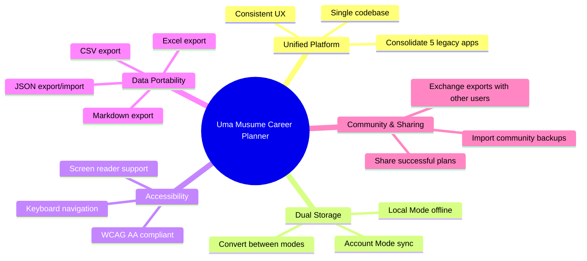
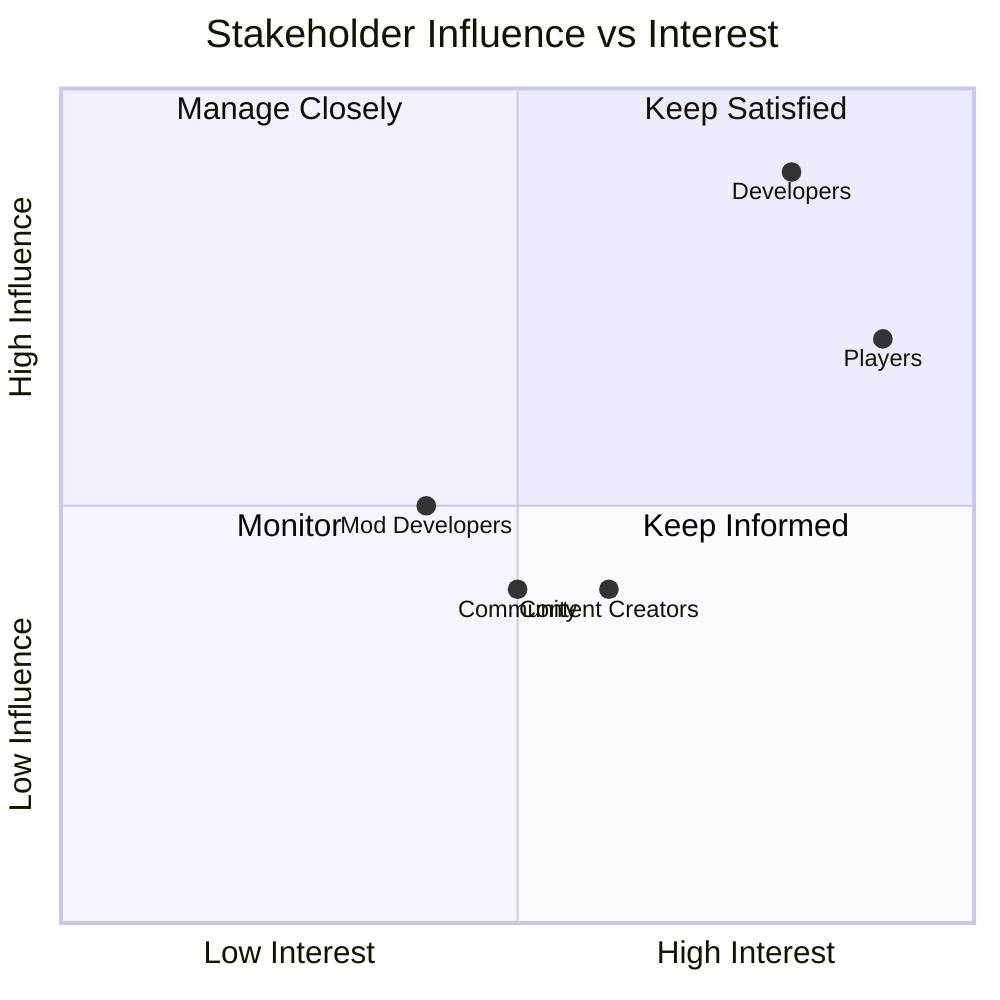
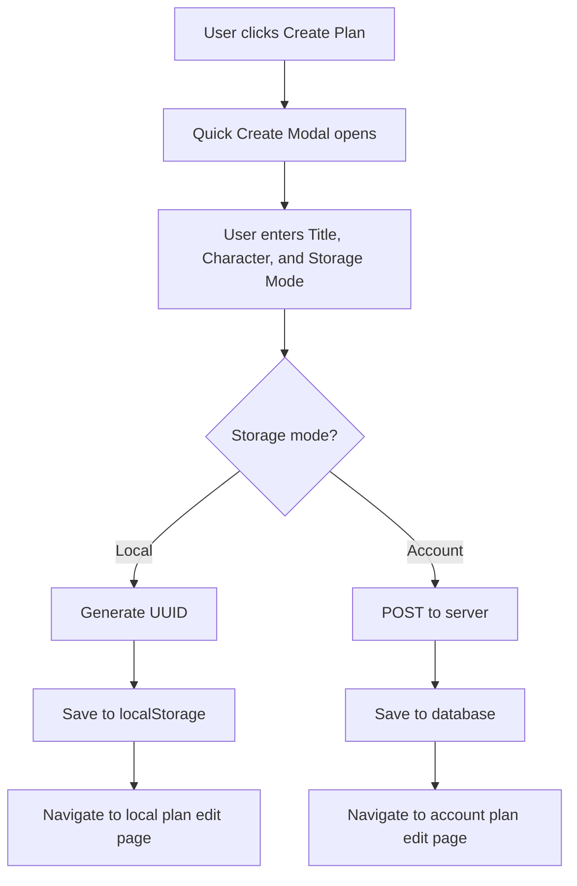
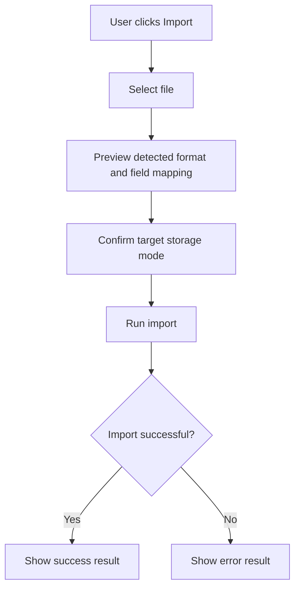
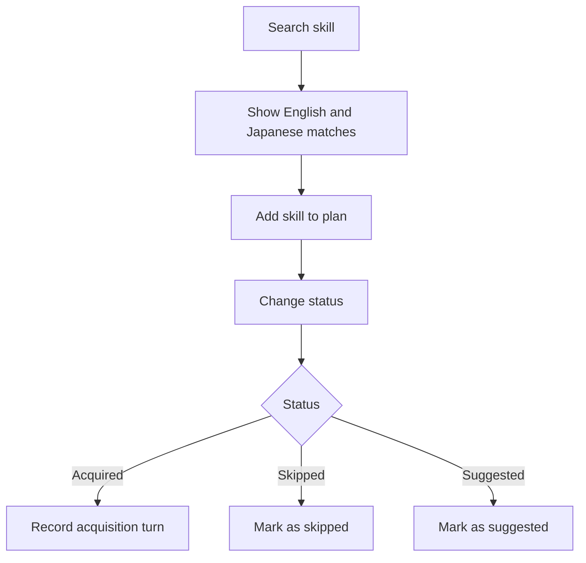
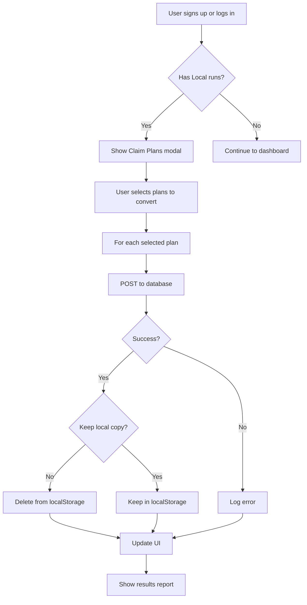
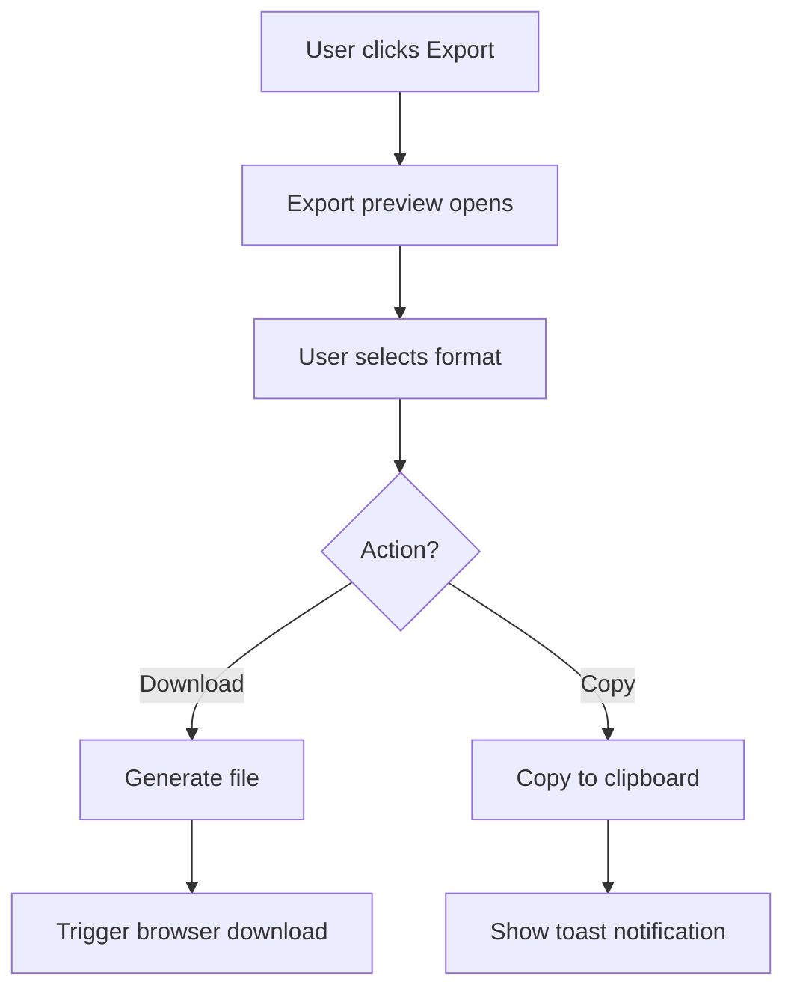
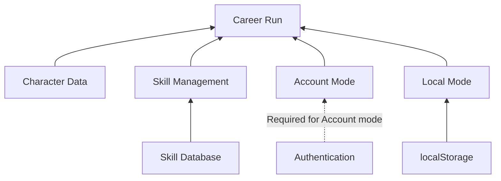

# D02 - Business Requirements Specifications

## Uma Musume Career Planner

**Document Version:** 3.0  
**Date:** 2026-07-03  
**Status:** Active

---

## 1. Introduction

### 1.1 Purpose

This document defines the business requirements for the Uma Musume Career Planner application. It establishes the business context, stakeholder needs, and high-level requirements that guide technical implementation.

This BRS feeds directly into the SRS and SDP and is the single source of truth for business priorities.

### 1.2 Scope

The Uma Musume Career Planner is a web application that enables players of Uma Musume: Pretty Derby to track, manage, and analyze their career progression. The system consolidates features from five legacy applications into a unified platform.

This document covers the MVP scope, which consists of Priority 0 and Priority 1 requirements. Priority 2 and Priority 3 requirements are recorded as post-MVP candidates and may be implemented later.

### 1.3 Feature Summary

- Dual storage support for Local mode and Account mode.
- Career run creation, editing, and turn-by-turn progress tracking.
- Character management with aptitude grades, growth rates, and image support.
- Skill management with bilingual English/Japanese search and status tracking.
- Export options for JSON, Excel, CSV, and Markdown.
- Import workflows for backups, schema upgrades, and legacy migration.
- Race planning, goals, charts, and snapshot-style progress review.
- Accessibility, responsive layout, dark/light theme support, and reduced-motion behavior.

### 1.4 Definitions and Acronyms

| Term | Definition |
| --- | --- |
| Plan / Career Run | A career run record tracking an Uma Musume character's training progression. |
| Uma Musume | A horse girl character from the Uma Musume: Pretty Derby game. |
| SP (Skill Points) | Points earned from races and events that are spent to purchase skills. |
| Stat Max | The maximum raw stat value stored in the system, capped at 1200. |
| URA Finale | The final race series at the end of Senior Year. |
| Trainer | The player role managing training choices, races, and skills. |
| Support Cards | Training support cards that influence stat gains and event outcomes. |
| Race Grade | A race classification such as G1, G2, or G3. |

---

## 2. Business Context

### 2.1 Business Problem

Players of Uma Musume: Pretty Derby currently lack a comprehensive, unified tool to:

- Track character training progression across multiple career runs.
- Plan skill acquisitions and race strategies.
- Analyze training effectiveness and outcomes.
- Export and share training records.
- Access data across devices or offline.
- Avoid data loss risk when relying only on a single device or browser storage without a backup path.

### 2.2 Business Opportunity

By consolidating five legacy tracking applications into one modern platform, we can:

- Provide a superior user experience with modern web technologies.
- Enable offline-first usage for players without reliable connectivity.
- Support cross-device access for authenticated users.
- Improve accessibility for users with disabilities.
- Reduce maintenance overhead of multiple codebases.
- Support community sharing through export and import workflows so users can exchange successful training plans and templates.

### 2.3 Business Objectives

| Objective | Success Metric |
| --- | --- |
| User adoption | Active users tracking plans. |
| Legacy data migration | Number of successful imports from each legacy format. |
| Accessibility | WCAG AA compliance. |
| Performance | Page load under 2 seconds. |
| Reliability | 99% uptime for Account mode. |

### 2.4 Value Proposition



---

## 3. Stakeholder Analysis

### 3.1 Primary Stakeholders

#### 3.1.1 Players (End Users)

Needs:

- Quick and easy plan creation.
- Offline access to data.
- Cross-device synchronization.
- Data export for sharing and backup.
- Accessible interface.

Pain points:

- Current tools are fragmented.
- No reliable backup path when using a single browser or device.
- Poor mobile experience.
- Data locked in one application.

#### 3.1.2 Developers / Maintainers

Needs:

- Single codebase to maintain.
- Modern, well-documented architecture.
- Comprehensive test coverage.
- Clear development standards.

### 3.2 Secondary Stakeholders

#### 3.2.1 Content Creators

YouTubers, guide writers, and community educators benefit from Excel and Markdown exports when creating walkthroughs, comparisons, and training guides.

#### 3.2.2 Mod Developers

Mod developers and data tool authors benefit from canonical exports, stable field names, and importable plan data that can be reused in external tooling.

### 3.3 Stakeholder Map



---

## 4. Business Requirements

### 4.1 Requirements Priority Summary

| Priority | Count |
| --- | --- |
| P0 - Critical | 32 |
| P1 - High | 16 |
| P2 - Medium | 3 |
| P3 - Low | 0 |

### 4.2 Character Management [BR-1]

Business need: Players need to manage their Uma Musume character roster with complete information.

| ID | Requirement | Priority |
| --- | --- | --- |
| BR-1.1 | Create, view, update, and delete character records. | P0 |
| BR-1.2 | Store character images in server-backed storage for Account mode and store only the image path or URL reference in localStorage for Local mode. Image uploads must support JPEG, PNG, and WebP files up to 2 MB. | P1 |
| BR-1.3 | Track aptitude grades for terrain, distance, and style. | P0 |
| BR-1.4 | Track growth rate bonuses for all five stats. | P0 |

### 4.3 Career Run Management [BR-2]

Business need: Players need to track individual training runs from start to completion.

| ID | Requirement | Priority |
| --- | --- | --- |
| BR-2.1 | Create career runs linked to characters. | P0 |
| BR-2.2 | Track career year (Junior, Classic, Senior). | P0 |
| BR-2.3 | Track run status (In Progress, Completed, Archived). | P0 |
| BR-2.4 | Track current turn, total SP available, and stamina_percentage. | P0 |
| BR-2.5 | Support quick creation in a single modal where the user enters title, character, and storage mode (Local or Account) before creation is submitted. | P0 |

### 4.4 Stat Progression Tracking [BR-3]

Business need: Players need to log and visualize stat changes throughout a career run.

| ID | Requirement | Priority |
| --- | --- | --- |
| BR-3.1 | Log turn-by-turn stats (Speed, Stamina, Power, Guts, Wit). | P0 |
| BR-3.2 | Visualize stat progression with charts. | P1 |
| BR-3.3 | Validate raw stat values within 0 to 1200. Effective stat values after bonuses may exceed 1200, but raw stored values must remain capped at 1200. | P0 |
| BR-3.4 | Calculate stat totals and growth rates. | P0 |

### 4.5 Skill Management [BR-4]

Business need: Players need to plan and track skill acquisitions.

| ID | Requirement | Priority |
| --- | --- | --- |
| BR-4.1 | Search skills from the reference database. | P0 |
| BR-4.2 | Track skill status (Acquired, Skipped, Suggested). | P0 |
| BR-4.3 | Track the turn when a skill was acquired. | P0 |
| BR-4.4 | Calculate SP totals for acquired and planned skills. | P0 |
| BR-4.5 | Search English and Japanese skill names simultaneously in autocomplete results. | P0 |

### 4.6 Race Planning [BR-5]

Business need: Players need to plan race schedules and track results.

| ID | Requirement | Priority |
| --- | --- | --- |
| BR-5.1 | Record race predictions with venue and distance. | P1 |
| BR-5.2 | Track predicted versus actual placement. | P1 |
| BR-5.3 | Capture race-day snapshots of character state. | P2 |
| BR-5.4 | Display recommended stamina thresholds. | P1 |

### 4.7 Goals Management [BR-6]

Business need: Players need to set and track training objectives.

| ID | Requirement | Priority |
| --- | --- | --- |
| BR-6.1 | Create goals with descriptions. | P1 |
| BR-6.2 | Track goal completion status. | P1 |
| BR-6.3 | Visually distinguish completed goals. | P1 |

### 4.8 Data Export [BR-7]

Business need: Players need to export data for backup, sharing, and analysis.

| ID | Requirement | Priority |
| --- | --- | --- |
| BR-7.1 | Export to JSON format. | P0 |
| BR-7.2 | Export to Excel format (.xlsx). | P0 |
| BR-7.3 | Export to CSV format. | P1 |
| BR-7.4 | Export to plain text or Markdown. | P1 |
| BR-7.5 | Preview export data before download. | P1 |
| BR-7.6 | Copy export data to the clipboard. | P1 |
| BR-7.7 | Include schema version metadata for compatibility. | P1 |

### 4.9 Data Import [BR-8]

Business need: Players need an import-first workflow for restoring backups, validating shared files, and bringing external data into either storage mode.

| ID | Requirement | Priority |
| --- | --- | --- |
| BR-8.1 | Import from JSON format. | P0 |
| BR-8.2 | Detect and migrate schema versions. | P1 |
| BR-8.3 | Preview data before import. | P1 |
| BR-8.4 | Detect duplicate records before import. | P1 |
| BR-8.5 | Support import to Local storage or Account storage. | P1 |

### 4.10 Dual Storage Mode [BR-9]

Business need: Players need flexibility in how their data is stored and accessed.

| ID | Requirement | Priority |
| --- | --- | --- |
| BR-9.1 | Support Local storage mode using browser localStorage for offline play. | P0 |
| BR-9.2 | Support Account storage mode using the server database for authenticated persistence. | P0 |
| BR-9.3 | Provide a clear visual indication of the active storage mode. | P0 |
| BR-9.4 | Preserve full offline functionality for Local runs. | P0 |
| BR-9.5 | Convert Local runs to Account runs. | P0 |
| BR-9.6 | Provide a local data management interface that can show storage usage, list local runs, delete selected local runs, and perform bulk export. | P1 |

### 4.11 User Interface [BR-10]

Business need: Players need an intuitive, accessible interface.

| ID | Requirement | Priority |
| --- | --- | --- |
| BR-10.1 | Provide a Dark/Light mode toggle with persistence. | P0 |
| BR-10.2 | Support responsive layouts from 320 px to 2560 px. | P0 |
| BR-10.3 | Meet WCAG AA accessibility expectations. | P0 |
| BR-10.4 | Support keyboard navigation. | P1 |
| BR-10.5 | Respect reduced-motion preferences. | P1 |

### 4.12 Authentication [BR-11]

Business need: Some players want cross-device access and cloud backup, while others only need Local mode.

| ID | Requirement | Priority |
| --- | --- | --- |
| BR-11.1 | Authentication is required for Account storage mode. | P0 |
| BR-11.2 | Local mode must remain fully usable without authentication. | P0 |
| BR-11.3 | Support a Claim Plans flow for converting Local plans to Account plans after sign-up or log-in. | P2 |

### 4.13 Legacy Data Migration [BR-12]

Business need: Players need a dedicated migration path for data imported from legacy Uma Musume tracker applications.

| ID | Requirement | Priority |
| --- | --- | --- |
| BR-12.1 | Support migration from the five legacy tracker formats used by the project history. | P0 |

Supported legacy formats:

| Legacy Application | Format | Notes |
| --- | --- | --- |
| uma-run-tracker | JSON | Primary legacy import source. |
| umamusume-tracker | JSON/API | Secondary legacy import source. |
| uma-tracker | SQLite/MySQL | Database-backed legacy source. |
| uma_musume_race_planner | MySQL dump | Earlier consolidated legacy source. |
| uma-tracker-form | CSV export | Spreadsheet-style legacy source. |

---

## 5. Business Rules

### 5.1 Data Validation Rules

| Rule ID | Rule Description |
| --- | --- |
| BV-1 | Plan title is required and cannot be empty. |
| BV-2 | Raw stat values must be between 0 and 1200. Effective stat values may exceed 1200 after bonuses, but raw stored values must never exceed 1200. |
| BV-3 | Turn numbers must be between 1 and 78. |
| BV-4 | Skill status "Acquired" requires a turn_acquired value. |
| BV-5 | stamina_percentage must be between 0 and 100. |
| BV-6 | Turn numbers auto-increment when adding a new stat record and must remain uniquely linked to that specific turn. |

### 5.2 Calculation Rules

| Rule ID | Rule Description |
| --- | --- |
| BC-1 | Acquired SP equals the sum of sp_cost values where status = acquired. |
| BC-2 | Mood modifiers: Great +4%, Good +2%, Normal 0%, Bad -2%, Awful -4%. |
| BC-3 | Aptitude effectiveness: SS=120%, S=110%, A=100%, B=90%, C=80%, D=70%, E=60%, F=50%, G=40%. |

### 5.3 Storage Rules

| Rule ID | Rule Description |
| --- | --- |
| BS-1 | Local runs use UUID identifiers. |
| BS-2 | Account runs use database integer IDs. |
| BS-3 | Local runs are fully functional offline. |
| BS-4 | Account runs require network connectivity to save. |
| BS-5 | Drafts are always saved to localStorage regardless of storage mode. |

---

## 6. Business Process Flows

### 6.1 Use Cases

- Create a new plan in Local mode or Account mode.
- Record turn-by-turn stat updates and manage skill choices.
- Export plans for backup, analysis, sharing, or community use.
- Import backups or legacy tracker data into either storage mode.
- Convert existing Local plans into Account plans after authentication.

### 6.2 Plan Creation Flow

```text
User clicks "Create Plan"
    |
    v
Quick Create Modal opens
    |
    v
User enters: Title, Character, Storage Mode
    |
    v
If Local: Generate UUID and save to localStorage
    |
    v
Navigate to /plans/local/{uuid}/edit

If Account: POST to server and save to database
    |
    v
Navigate to /plans/{id}/edit
```



### 6.3 Importing Data Flow

```text
User clicks "Import"
    |
    v
File selection opens
    |
    v
System previews detected data and field mapping
    |
    v
User confirms import target
    |
    v
Import runs
    |
    v
Show success or error result
```



### 6.4 Skill Management Flow

```text
User searches for a skill
    |
    v
System shows English and Japanese matches
    |
    v
User adds the skill to the plan
    |
    v
User changes status to Acquired, Skipped, or Suggested
```



### 6.5 Local to Account Conversion Flow

```text
User signs up or logs in
    |
    v
Claim Plans modal appears if Local runs exist
    |
    v
User selects plans to convert
    |
    v
For each plan, POST to database
    |
    v
If success, delete local copy or keep it if requested
    |
    v
Show results report
```



### 6.6 Data Export Flow



---

## 7. Non-Functional Requirements

### 7.1 Performance

- Primary screens should load quickly enough to keep plan editing responsive during normal use.
- Export, import, and conversion actions should complete without blocking unrelated UI interactions longer than necessary.

### 7.2 Security

- File uploads must validate type and size before storage.
- Import workflows must validate schema and reject malformed or unexpected payloads.
- Account mode access must be protected by authentication.

### 7.3 Maintainability

- Canonical field names must be used consistently across forms, services, storage, and API payloads.
- Reusable components should be preferred for repeated plan-editing and export flows.
- Requirements and migration paths should remain documented so business and technical scope stay aligned.

---

## 8. Success Metrics

### 8.1 User Experience Metrics

| Metric | Target | Measurement Method |
| --- | --- | --- |
| Time to create first plan | Under 30 seconds | User testing |
| Task completion rate | Over 95% | Analytics |
| User satisfaction | Over 4/5 stars | Surveys |

### 8.2 Technical Metrics

| Metric | Target | Measurement Method |
| --- | --- | --- |
| Page load time | Under 2 seconds | Performance monitoring |
| First Contentful Paint | Under 1.5 seconds | Lighthouse |
| Accessibility score | 100% AA | axe-core |
| Error rate | Under 1% | Error logging |

### 8.3 Adoption Metrics

| Metric | Target | Measurement Method |
| --- | --- | --- |
| Successful legacy data imports | Percentage without errors | Import logs |
| Number of successful imports from each legacy format | Track each supported source separately | Import logs |
| Export usage | Exports per week | Analytics |
| Local to Account conversions | Track adoption | Analytics |
| Feature utilization | Monitor usage | Analytics |

---

## 9. Constraints and Assumptions

### 9.1 Constraints

1. Browser storage limits mean localStorage is typically constrained to about 5 to 10 MB.
2. Local mode operates entirely client-side without server dependencies after the application assets have loaded.
3. Account runs cannot be saved without connectivity.
4. Browser support is limited to modern browsers such as Chrome, Firefox, Safari, and Edge.
5. The MVP is web-only and does not include native apps.

### 9.2 Assumptions

1. Users have access to modern web browsers.
2. Users possess a baseline understanding of Uma Musume mechanics and terminology.
3. Users have sufficient browser storage for Local runs.
4. English is the primary interface language, with Japanese skill names supported.

---

## 10. Dependencies

### 10.1 External Dependencies

| Dependency | Description | Risk Level |
| --- | --- | --- |
| Browser localStorage API | Local run storage and draft persistence | Low |
| Browser localStorage API limits | Constrains how much local data can be retained | Medium |
| Livewire connection | Account run operations | Medium |
| Database availability | Account data persistence | Medium |

### 10.2 Internal Dependencies

| Dependency | Description |
| --- | --- |
| Character data | Required before creating career runs. |
| Skill reference database | Must be pre-populated with English and Japanese translations for autocomplete. |
| Authentication | Required for Account mode, optional for Local mode. |

### 10.3 Dependency Graph



---

## 11. Appendices

### 11.1 Glossary of Game Terms

| Term | Japanese | Definition |
| --- | --- | --- |
| Speed | スピード | Determines maximum running speed. |
| Stamina | スタミナ | Determines HP and effective stamina. |
| Power | パワー | Affects acceleration and lane-changing. |
| Guts | 根性 | Affects last spurt and stamina consumption. |
| Wit | 賢さ | Affects skill activation rate. |
| Nige | 逃げ | Front Runner running style. |
| Senkou | 先行 | Pace Chaser running style. |
| Sashi | 差し | Late Surger running style. |
| Oikomi | 追込 | End Closer running style. |
| URA Finale | URA Finale | The final race series at the end of Senior Year. |
| Trainer | トレーナー | The player or coach managing the career run. |
| Support Cards | サポートカード | Training support cards that influence stat gains and events. |
| Race Grade | レース格付け | The class or tier of a race, such as G1, G2, or G3. |

### 11.2 Canonical Field Names

These field names must be used uniformly across all codebase layers, forms, and API payloads to prevent data mapping errors.

| UI Label | Canonical Field | Notes |
| --- | --- | --- |
| SP Balance | total_sp_available | Use this canonical field in code. |
| Stamina % | stamina_percentage | Use this canonical field in code. |
| Turn | turn_number | Used in StatProgress records. |
| Current Turn | current_turn | Used in CareerRun records. |

### 11.3 Related Documents

- D01_System_Development_Plan
- D03_System_Requirements_Specifications
- D04_System_Design_Specifications
- docs/migration/README.md
- README.md

### 11.4 Revision History

| Version | Date | Author | Changes |
| --- | --- | --- | --- |
| 1.0 | 2026-01-03 | System | Initial draft. |
| 2.0 | 2026-01-03 | System | Added Mermaid diagrams and updated structure. |
| 3.0 | 2026-07-03 | System | Refined scope, priorities, terminology, and legacy migration coverage. |
