# D04 - System Design Specifications

## Uma Musume Career Planner

**Document Version:** 3.0
**Date:** 2026-07-03
**Status:** Active
**Last Updated:** 2026-07-03

---

## Table of Contents

1. [Introduction](#1-introduction)
2. [System Architecture](#2-system-architecture)
3. [Component Design](#3-component-design)
4. [Data Models](#4-data-models)
5. [Service Layer Design](#5-service-layer-design)
6. [Security Design](#6-security-design)
7. [Performance & Scalability](#7-performance--scalability)
8. [Error Handling & Logging](#8-error-handling--logging)
9. [UI/UX Design Specifications](#9-uiux-design-specifications)
10. [Data Flow Specifications](#10-data-flow-specifications)
11. [Testing Strategy](#11-testing-strategy)
12. [Third-Party Libraries](#12-third-party-libraries)
13. [Appendices](#13-appendices)

---

## 1. Introduction

### 1.1 Purpose

This document defines the system design for the Uma Musume Career Planner. It translates the business requirements in D02 into implementation-oriented architecture, components, data models, services, and UI patterns, while staying traceable to the SRS in D03 and the SDP in D01.

### 1.2 Scope of Design

This design covers the MVP scope and the extensibility needed for post-MVP evolution.

Covered:

- Browser-first Local mode and authenticated Account mode.
- Core plan creation, editing, import, export, skill management, turn tracking, and dashboard flows.
- Shared Livewire page components, reusable UI primitives, and service boundaries.
- Data validation, schema versioning, logging, and migration paths for local data.
- Accessibility, responsive layout, and testability requirements.

Out of scope:

- Native iOS or Android applications.
- Desktop applications or browser extensions.
- Real-time collaborative editing.
- Social, multiplayer, or community-sharing features beyond import/export.
- Unspecified external APIs or integrations not required by D03.

### 1.3 Relationship to BRS and SRS

- D02 describes the business goals, MVP priorities, and user outcomes.
- D03 translates those business needs into testable system requirements.
- This SDS translates the SRS into concrete design decisions, implementation patterns, and component boundaries.

Where D03 states what the system must do, this document explains how the Laravel application should do it.

### 1.4 References

- [D01_System_Development_Plan.md](D01_System_Development_Plan.md)
- [D02_Business_Requirements_Specifications.md](D02_Business_Requirements_Specifications.md)
- [D03_System_Requirements_Specifications.md](D03_System_Requirements_Specifications.md)

---

## 2. System Architecture

### 2.1 High-Level Architecture Diagram

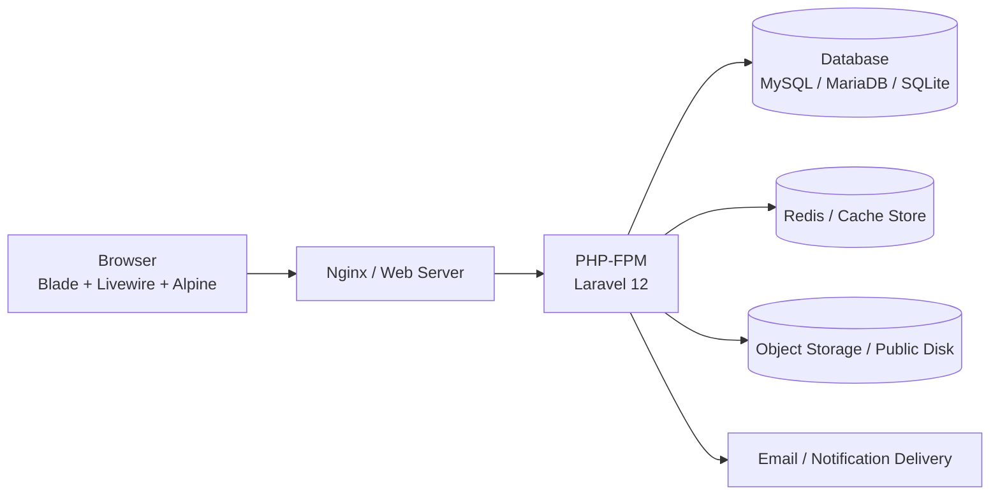

The production deployment is browser driven and server rendered. The browser owns the immediate UI state; Laravel owns validation, authorization, persistence, and server-side workflows.

### 2.2 Architecture Overview

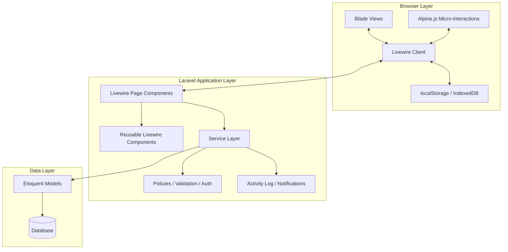

### 2.3 Storage Mode Architecture

Storage mode is a first-class design concern.

- Local mode stores plan data in the browser and works without authentication.
- Account mode stores plan data in the database and requires authentication.
- Conversion from Local to Account is handled by a dedicated service and UI flow.

Data consistency notes:

- Local mode does not provide cross-tab locking.
- If the same local plan is edited in multiple tabs, the last save wins unless the UI detects a stale draft and prompts the user.
- Account mode is server authoritative, but concurrent edits can still overwrite each other unless an explicit conflict check or optimistic locking strategy is added.
- The current design should surface dirty-state warnings and conflict prompts rather than silently merging divergent edits.

```mermaid
flowchart TD
    A[User Action] --> B{Authenticated?}
    B -->|No| C[Local Mode Only]
    B -->|Yes| D{Choose Storage Mode}
    C --> E[Browser Storage]
    D -->|Local| E
    D -->|Account| F[(Database)]
    E --> G[UUID Route<br/>/plans/local/{uuid}]
    F --> H[ID Route<br/>/plans/{id}]
```

### 2.4 Request Flow

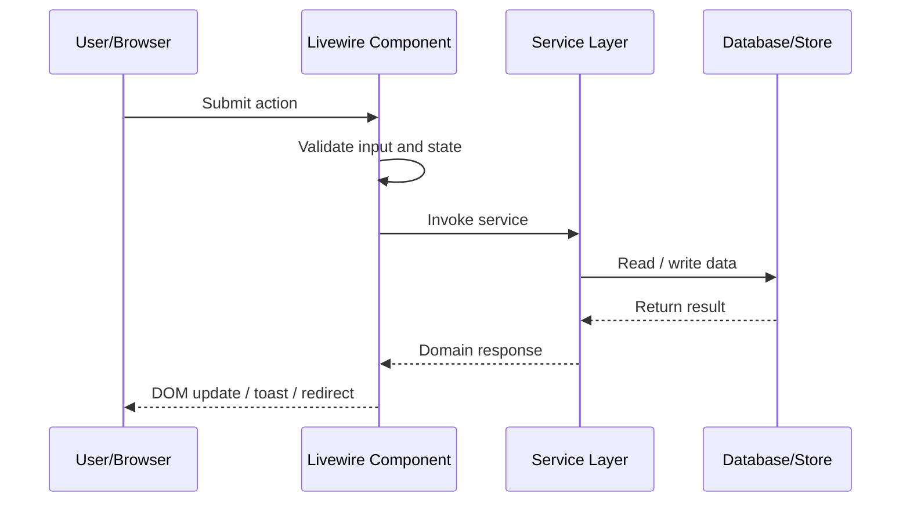

### 2.5 Error Handling Flow

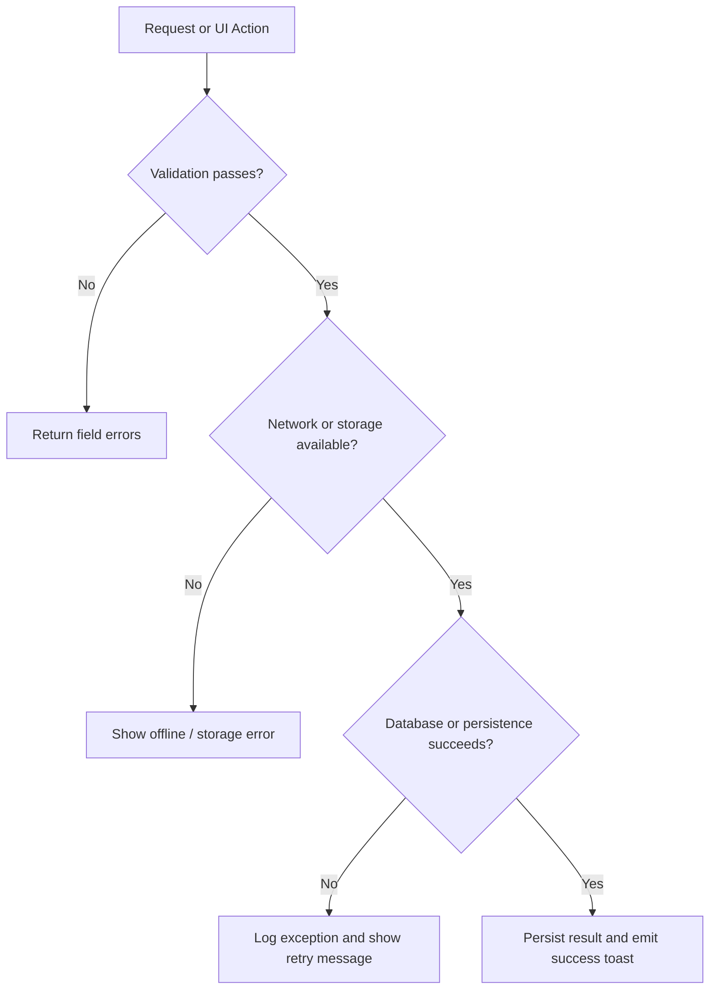

### 2.6 Local Storage Request Flow

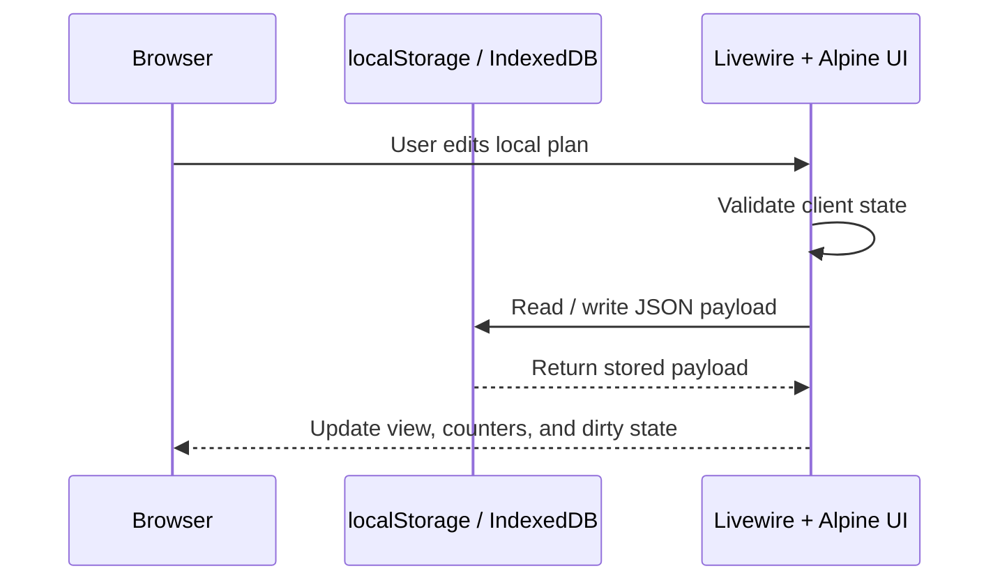

---

## 3. Component Design

### 3.1 Page Components

| Route | Component Class | Purpose | Notes |
| --- | --- | --- | --- |
| `/` and `/dashboard` | Blade dashboard shell with Livewire widgets | Main landing page with plan list, stats, activity, and quick actions | Dashboard should compose smaller Livewire widgets rather than hold all logic in one class. |
| `/plans/{id}` and `/plans/{id}/view` | `App\Livewire\Dashboard\PlanDetailsPage` | Read-only Account plan view | Show mode should be read-only and share logic with edit mode through a base class or trait. |
| `/plans/{id}/edit` | `App\Livewire\Dashboard\PlanDetailsPage` | Account plan editor | The edit route should share the same base class or trait as the view route. |
| `/plans/local/{uuid}` and `/plans/local/{uuid}/view` | `App\Livewire\Plans\LocalPlanView` | Read-only Local plan view | `LocalPlanView` should share a base class or trait with Account counterparts for common loading, formatting, and dirty-state behavior. |
| `/plans/local/{uuid}/edit` | `App\Livewire\Plans\LocalPlanView` or future `LocalPlanEdit` | Local plan editor | If `LocalPlanEdit` is introduced, it should reuse the same shared plan base class or trait. |
| `/characters` | `App\Livewire\Characters\CharacterList` | Character roster browsing and filtering | Supports the shared canonical roster used by plan creation and editing. |
| `/guide` | Blade guide page | Usage and navigation help | Primarily static content with sticky navigation. |
| `/import` | `App\Livewire\Import\ImportWizard` | Multi-step import flow | The import wizard should own preview, validation, conflict resolution, and final execution. |
| `/local-data` | `App\Livewire\LocalData\Manager` | Local storage management | Handles export, import, bulk conversion, purge, and storage statistics. |

### 3.2 Reusable Livewire Components

| Component | Purpose | Props / Parameters | Public State / Key Fields |
| --- | --- | --- | --- |
| `App\Livewire\Dashboard\PlanList` | Filterable plan listing | `currentFilter`, `storageModeFilter`, `strategyFilter` | `public string $currentFilter`, `public string $storageModeFilter`, `public ?int $strategyFilter` |
| `App\Livewire\Dashboard\StatsPanel` | Summary counters and high-level metrics | `counts`, `storageCounts` | Computed counters only; keep state minimal. |
| `App\Livewire\Dashboard\RecentActivity` | Recent activity stream | `activities`, `limit` | `public int $limit` if paging or filtering is added. |
| `App\Livewire\Dashboard\PlanInlineDetails` | Inline expand/collapse detail view | `planId`, `expanded` | `public int|null $expandedPlanId` or equivalent local state. |
| `App\Livewire\QuickCreatePlan` | Quick create modal | `storageMode`, `defaultStage`, `characterId` | `public string $title`, `public string $storageMode`, `public ?int $characterId` |
| `App\Livewire\Skills\SkillEditor` | Add, remove, and save skills | `skills` | `public array $skills = []` |
| `App\Livewire\Skills\SkillSearch` | Skill autocomplete | `query`, `limit`, `planId` | `public string $query`, `public array $results = []` |
| `App\Livewire\Plans\TrainingYear` | Group turns by career year | `year`, `turns` | `public int|string $year`, `public array|Collection $turns` |
| `App\Livewire\Plans\SkillRow` | Individual skill row editor | `skill`, `index` | `public array $skill` or model-backed row state |
| `App\Livewire\Common\Toast` | Notification stack | `type`, `message`, `duration` | `public array $toasts = []`, `public int $duration = 5000` |
| `App\Livewire\Common\ConfirmModal` | Confirmation dialog | `message`, `confirmAction`, `cancelAction` | `public bool $show`, `public string $message` |
| `App\Livewire\Common\DirtyStateWarning` | Dirty state prompt | `isDirty`, `message` | `public bool $isDirty`, `public bool $show` |
| `App\Livewire\CareerRun\StorageModeIndicator` | Storage mode badge | `mode` | `public string|StorageMode $mode` |
| `App\Livewire\CareerRun\ConvertToAccountButton` | Conversion action entry point | `runId`, `uuid` | `public bool $disabled` if auth or validation blocks action. |
| `App\Livewire\Export\ExportModal` | Export configuration and execution | `plan`, `format` | `public string $format`, `public array $selectedIds = []` |
| `App\Livewire\Auth\ConvertRunModal` | Authenticated conversion flow | `runs`, `bulkMode` | `public array $runs = []`, `public bool $bulkMode = false` |

### 3.3 Alpine.js Components

| Component | Purpose | Interaction | Used Within Livewire |
| --- | --- | --- | --- |
| `x-dropdown` | Context and menu dropdowns | Toggle open/close state, close on outside click, keyboard navigation | Yes, usually inside Livewire headers, filters, and action menus. |
| `x-modal` | Modal dialog wrapper | Show/hide overlays, trap focus, handle Escape key | Yes, usually wraps Livewire forms or actions. |
| `x-tabs` | Tab navigation | Set active tab and preserve panel visibility | Yes, commonly inside Livewire editors. |
| `x-tooltip` | Hover or click tooltips | Display contextual help and small hints | Yes, often attached to Livewire form labels and badges. |
| `x-dark-mode` | Theme toggle | Persist theme choice and sync DOM class | Yes, often mounted in the app layout rather than inside a single component. |
| `x-toast` | Notification stack | Show ephemeral success, warning, and error messages | Yes, typically listens to Livewire events. |
| `x-confirm` | Confirmation dialog | Require an explicit confirm action before destructive changes | Yes, often used with delete and purge actions. |

### 3.4 Component Hierarchy

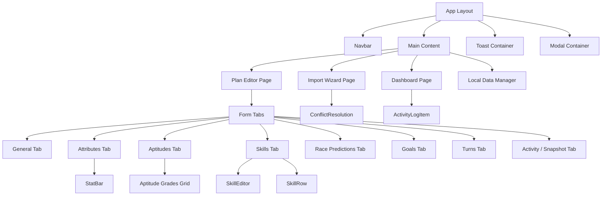

#### Import Wizard Flow

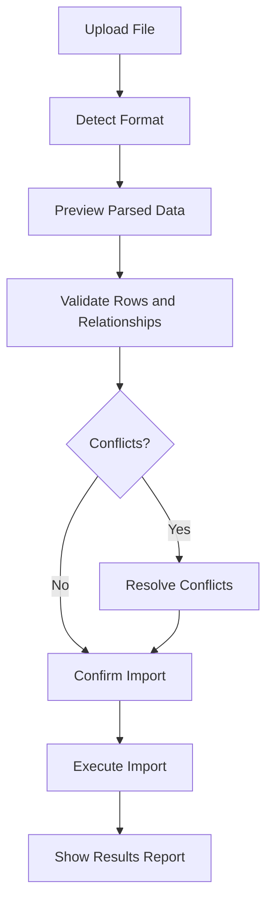

### 3.5 Blade Component Library

All Blade components accept `class` and `data-testid` attributes.

| Component | Purpose | Accepts Slot | Notes |
| --- | --- | --- | --- |
| `components/layout/app` | Main application shell | Yes | Owns the header, content area, toasts, and modal mount points. |
| `components/layout/navigation` | Primary navigation bar | Yes | Hosts global links, search, and account actions. |
| `components/layout/footer` | Footer content | Yes | Lightweight layout support. |
| `components/forms/input` | Text input | No | Should forward validation styles and aria attributes. |
| `components/forms/select` | Select dropdown | No | Use for enumerations and lookup tables. |
| `components/forms/textarea` | Multi-line input | No | Used for notes and descriptions. |
| `components/forms/checkbox` | Boolean input | No | Used for conversion and import toggles. |
| `components/buttons/primary` | Primary action button | Yes | Used for save and create actions. |
| `components/buttons/secondary` | Secondary action button | Yes | Used for cancel and back actions. |
| `components/buttons/danger` | Destructive action button | Yes | Used for delete, purge, and clear actions. |
| `components/common/card` | Generic card container | Yes | Used throughout dashboard and editor views. |
| `components/common/modal` | Modal wrapper | Yes | Should support focus management and size variants. |
| `components/common/table` | Tabular data container | Yes | Used for skills, turns, race predictions, and activity. |
| `components/common/badge` | Status or label chip | Yes | Used for storage mode, run status, and skill state. |
| `components/common/toast` | Notification toast | Yes | Can be paired with Livewire `Toast`. |
| `components/common/empty-state` | Empty state illustration and copy | Yes | Used when no plans, skills, or local runs exist. |
| `components/umamusume/stat-bar` | Single stat progress bar | No | Supports stat colors and cap display. |
| `components/umamusume/aptitude-badge` | Aptitude grade badge | No | Shows letter grade and effectiveness percentage. |
| `components/umamusume/storage-badge` | Local / Account storage badge | No | Identifies storage mode in lists and headers. |
| `components/umamusume/skill-card` | Skill summary card | Yes | Used in skill lookup and plan detail views. |

---

## 4. Data Models

### 4.1 Entity Model Overview

The business term is **Career Run**; the current Laravel implementation centers on the `Plan` model and its related tables. The SDS uses the business term where helpful and the implementation model where precision matters.

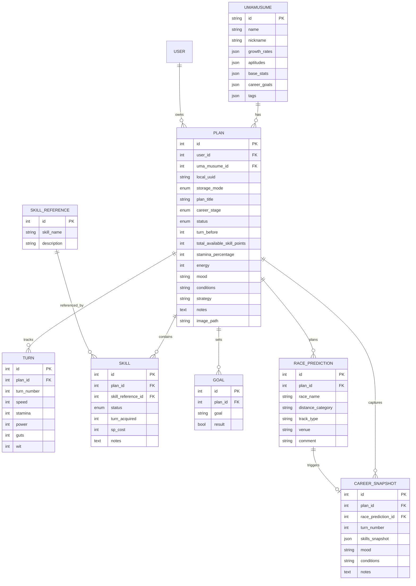

`UmaMusume` remains a shared roster model rather than a user-specific record, so a `user_id` column is not required unless future product scope introduces per-user character customization.

### 4.2 Model Definitions

#### 4.2.1 Design Rules

- Prefer `protected $guarded = [];` or a minimal guarded list for new models rather than adding large `$fillable` lists.
- Keep validation in Form Request classes or Livewire validation rules, not in the model itself.
- Use relationships with explicit return types for all foreign key associations.
- Use casts for enums, JSON columns, and integer counters.

#### 4.2.2 Career Run Model (Plan)

```php
class Plan extends Model
{
    protected $guarded = [];

    protected function casts(): array
    {
        return [
            'storage_mode' => StorageMode::class,
            'status' => RunStatus::class,
            'scenario' => Scenario::class,
            'stamina_percentage' => 'integer',
            'energy' => 'integer',
            'total_available_skill_points' => 'integer',
        ];
    }
}
```

#### 4.2.3 Validation Notes

- `storage_mode` must always be one of the supported modes.
- `turn_number` must remain sequential within a plan unless the user explicitly edits ordering.
- `turn_acquired` is required when a skill status is `Acquired`.
- `stamina_percentage`, `energy`, and stat values must be constrained to the agreed numeric ranges.
- `notes`, `conditions`, and `strategy` should be sanitized and length-limited before persistence.

### 4.3 Local Storage Schema

`LocalRunStorageService` must treat schema versioning as mandatory.

```php
// schema_version is required so older browser payloads can be migrated
// before they are rendered, edited, or converted to Account mode.
// migrateSchema() must normalize older versions before any save/export.
```

The local payload should contain:

- `schema_version`
- `created_at`
- `updated_at`
- `career_run`
- `stat_progress`
- `skills`
- `goals`
- `race_predictions`
- `snapshots`
- `activity_log`

### 4.4 Enums

```php
enum Strategy: string
{
    case Escaping = 'escaping';
    case Leading = 'leading';
    case Betweener = 'betweener';
    case Chasing = 'chasing';
}

enum Condition: string
{
    case Sunny = 'sunny';
    case Cloudy = 'cloudy';
    case Rainy = 'rainy';
    case Windy = 'windy';
    case Muddy = 'muddy';
    case Slippery = 'slippery';
}

enum DistanceCategory: string
{
    case Sprint = 'sprint';
    case Mile = 'mile';
    case Medium = 'medium';
    case Long = 'long';
}
```

Other canonical enums used by the app include `StorageMode`, `RunStatus`, `SkillStatus`, and `AptitudeGrade`.

### 4.5 TypeScript Interfaces

```ts
interface AptitudeGrade {
  value: 'SS' | 'S' | 'A' | 'B' | 'C' | 'D' | 'E' | 'F' | 'G';
  label: string;
  effectivenessPercentage: number;
  hexColor: string;
}

interface ImportTarget {
  value: 'local' | 'account';
  label: string;
  description: string;
  requiresAuth: boolean;
}

interface ImportResult {
  success: boolean;
  created: number;
  updated: number;
  skipped: number;
  errors: Array<{ row: number; message: string }>;
  imported_ids: Array<{ type: 'local' | 'account'; id: string | number }>;
}

interface LocalRunsStore {
  schema_version: string;
  created_at?: string;
  updated_at: string;
  runs: CareerRun[];
  last_modified: string;
}
```

---

## 5. Service Layer Design

### 5.1 Service Dependency Diagram

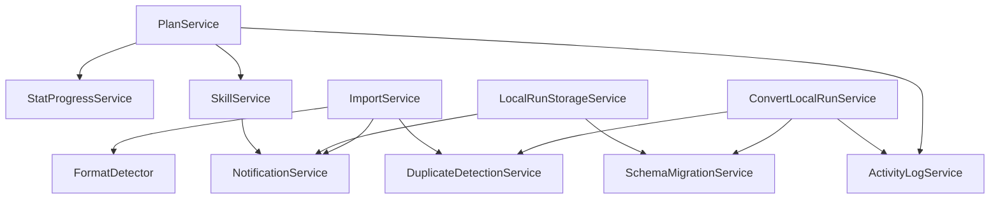

### 5.2 Core Services

#### PlanService

Responsibilities:

- Create, update, delete, and duplicate plans.
- Resolve a plan by numeric ID or UUID.
- Coordinate relationships, activity logging, and image processing.

Recommended public methods:

- `createDetailedPlan()`
- `createQuickPlan()`
- `updatePlan()`
- `getPlanByIdOrUuid()`
- `deletePlan()`
- `duplicatePlan()`

#### StatProgressService

Responsibilities:

- Add, update, and delete turn records.
- Produce pagination, totals, averages, and chart data.

Recommended public methods:

- `logTurn()` / `addTurn()`
- `updateTurn()`
- `deleteTurn()`
- `bulkCreate()`
- `getNextTurnNumber()`
- `getStatTotals()`

#### SkillService

Responsibilities:

- Search skill references across English and Japanese labels.
- Add, update, bulk update, and remove skills.
- Calculate SP totals and counts by status.

Caching strategy:

- Search cache key pattern: `skill_search_{md5(query|limit)}`.
- Suggested TTL for search results: 300 seconds.
- Suggested TTL for the full skill reference list: 3600 seconds.
- Cache invalidation should occur when a skill reference changes or when imports seed new records.

#### LocalRunStorageService

Responsibilities:

- Generate UUIDs for local runs.
- Validate and migrate browser payloads.
- Calculate storage usage and quota thresholds.
- Support list, delete, and clear operations.

Recommended public methods:

- `generateUuid()`
- `getSchemaVersion()`
- `createEmptyRun()`
- `validateStructure()`
- `migrateSchema()`
- `prepareForExport()`
- `prepareBulkExport()`
- `listAllRuns()`
- `deleteRun()`
- `clearAll()`

#### ImportService

Responsibilities:

- Detect input format using `FormatDetector`.
- Parse JSON and CSV sources through adapters.
- Preview, validate, and execute imports.
- Resolve duplicates before account writes.

Notes:

- CSV support must remain explicit in the service contract.
- Local imports should not require network calls.
- Account imports must verify authentication before execution.

#### New / Recommended Services

- `SchemaMigrationService`: normalize legacy local payloads and imported records.
- `NotificationService`: convert domain events into toast-friendly UI messages.
- `DuplicateDetectionService`: detect plan collisions by title, character, storage mode, or legacy identifiers.
- `ActivityLogService`: centralize audit-style log writes for plan and local-data actions.

---

## 6. Security Design

### 6.1 Authentication

- Use Laravel Sanctum for authenticated sessions and API access where needed.
- Local mode should remain usable without authentication.
- Authenticated Account mode should require a valid session before persistence actions proceed.

### 6.2 Authorization

- Use policies for plan ownership, local-data conversion, and destructive actions.
- Edit, delete, duplicate, export, and convert operations must confirm the current user can act on the target resource.

### 6.3 CSRF Protection

- All browser-submitted forms must use Laravel CSRF protection.
- Livewire requests inherit CSRF validation and should not bypass it.

### 6.4 Input Sanitization

- Validate all request and Livewire input on the server.
- Strip or constrain unsafe HTML in notes and descriptions if rich text is ever introduced.
- Normalize enum-like input values before persistence.

### 6.5 Upload Validation

- Restrict uploads by MIME type, file size, and extension.
- Validate images before storage or conversion.
- Reject malformed import files before they reach parsing or persistence layers.

---

## 7. Performance & Scalability

### 7.1 Performance Goals

- Keep dashboard and editor interactions responsive for normal datasets.
- Avoid unnecessary full-page reloads when Livewire can update a specific slice of UI.
- Keep browser-side local storage lightweight enough to remain usable before a quota warning is reached.

### 7.2 Pagination and Lazy Loading

- Use pagination for plan lists, turn histories, activity logs, and large skill result sets.
- Load detailed child records only when the user opens the relevant tab or panel.
- Use eager loading for relationships that are always displayed together.

### 7.3 Caching

- Cache skill lookups and lookup-table style data.
- Prefer short TTLs for user-facing search and longer TTLs for static reference data.
- Use cache invalidation when imports, seeding, or admin updates change reference content.

### 7.4 IndexedDB Migration Plan

Local mode currently depends on browser storage, but the design should allow a future move from `localStorage` to `IndexedDB` when records or payload size outgrow simple key/value storage.

Migration approach:

1. Read the current `schema_version`.
2. Migrate payloads in memory to the current format.
3. Write the normalized structure to the new storage backend.
4. Keep a compatibility reader for the previous format during rollout.
5. Remove the legacy backend only after the migration window closes.

---

## 8. Error Handling & Logging

### 8.1 Error Capture

- Validation failures should be handled at the Livewire or Form Request layer and returned as field errors.
- Service exceptions should be caught at the component boundary when a user-facing response is needed.
- Unexpected exceptions should bubble to Laravel’s exception handler and be logged centrally.

### 8.2 Logging

- Use application logs for unexpected failures and integration issues.
- Use activity logs for user-visible actions such as create, update, delete, duplicate, import, export, and conversion.
- Preserve enough context in logs to identify plan ID, UUID, user ID, and action type without storing secrets.

### 8.3 User Feedback

- Success, warning, and error states should appear as toasts or inline banners.
- Validation failures should stay visible near the relevant field.
- Conversion and import conflicts should present a clear resolution path rather than failing silently.

### 8.4 Error Response Pattern

| Condition | System Response | User Feedback |
| --- | --- | --- |
| Validation error | Reject the action and preserve state | Inline errors and summary toast where needed |
| Network failure | Preserve local draft state | Offline warning and retry action |
| Storage quota exceeded | Block the write and stop autosave | Quota warning with clear next steps |
| Database failure | Roll back the transaction and log the exception | Error toast and retry path |
| Import conflict | Pause execution until the user chooses a resolution | Conflict resolution modal |

---

## 9. UI/UX Design Specifications

### 9.1 Color System

```css
:root {
  --color-bg: #ffffff;
  --color-surface: #f8fafc;
  --color-text: #0f172a;
  --color-text-muted: #64748b;
  --color-border: #e2e8f0;

  --color-success: #16a34a;
  --color-warning: #d97706;
  --color-error: #dc2626;
  --color-info: #2563eb;

  --color-speed: #3399ff;
  --color-stamina: #33cc99;
  --color-power: #ff4d4d;
  --color-guts: #ffa500;
  --color-wit: #9933ff;

  --color-grade-SS: #e5e7eb;
  --color-grade-S: #ffd700;
  --color-grade-A: #ef4444;
  --color-grade-B: #f97316;
  --color-grade-C: #22c55e;
  --color-grade-D: #3b82f6;
  --color-grade-E: #a855f7;
  --color-grade-F: #6b7280;
  --color-grade-G: #9ca3af;
}

@media (prefers-color-scheme: dark) {
  :root {
    --color-bg: #0f172a;
    --color-surface: #111827;
    --color-text: #e5e7eb;
    --color-text-muted: #9ca3af;
    --color-border: #334155;

    --color-success: #4ade80;
    --color-warning: #f59e0b;
    --color-error: #f87171;
    --color-info: #60a5fa;

    --color-speed: #7cc0ff;
    --color-stamina: #7ee0c1;
    --color-power: #ff8585;
    --color-guts: #fbbf24;
    --color-wit: #c084fc;
  }
}
```

Dark mode must also work with explicit Tailwind `dark:` classes where the app uses utility-driven styling. The media query fallback is the minimum acceptable baseline.

### 9.2 Responsive Layout

| Breakpoint | Layout Goal | Grid / Tailwind Usage |
| --- | --- | --- |
| Mobile | Single column, stacked actions, condensed tables | `grid-cols-1`, `gap-4`, `w-full` |
| Tablet | Two-column layouts where useful | `md:grid-cols-2`, `md:gap-6` |
| Desktop | Multi-panel editor and dashboard cards | `lg:grid-cols-3`, `xl:grid-cols-4` |
| Wide | Max-width content with balanced whitespace | `max-w-7xl`, `xl:grid-cols-[...]` |

Guideline:

- Use CSS grid for editor layouts, card galleries, and dashboard panels.
- Use flexbox for controls, inline actions, and toolbars.
- Prefer gap utilities over manual margins for list spacing.

### 9.3 Component Specifications

#### StatBar

- Displays one stat value and its cap-relative progress.
- Supports stat color mapping, overflow indication above the soft cap, and accessible labels.
- Accepts `stat`, `value`, `max`, `label`, and `data-testid`.

#### ActivityLogItem

- Displays timestamp, action label, icon, and optional metadata.
- Must support keyboard focus if the item opens details.
- Accepts `entry`, `compact`, and `data-testid`.

#### ConflictResolution

- Used during imports and account conversion when titles or identifiers collide.
- Must present the source record, existing record, and the available action choices.
- Accepts `conflicts`, `resolutionMode`, and `data-testid`.

---

## 10. Data Flow Specifications

### 10.1 Plan Creation Flow

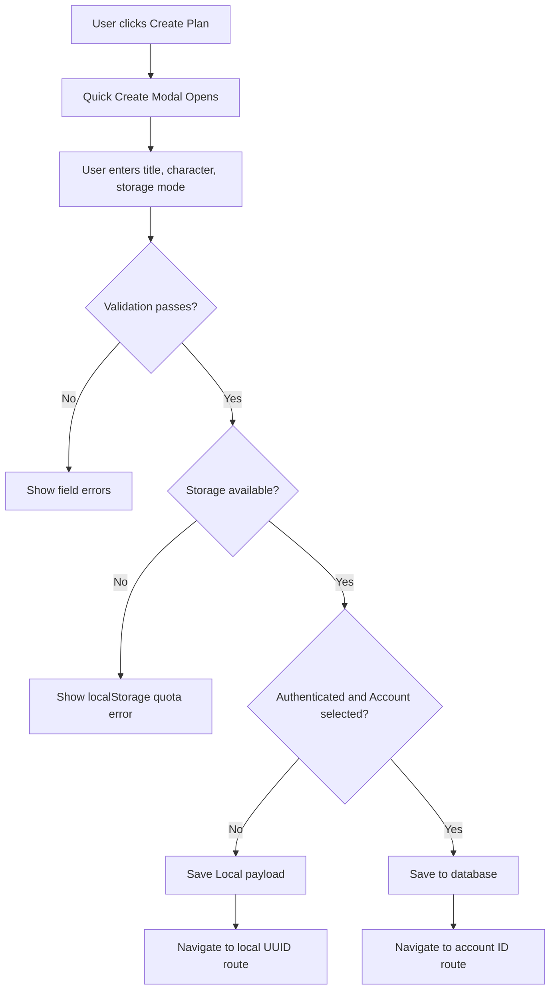

Error handling notes:

- If localStorage quota is exceeded, the user should be informed before the write is retried.
- If the browser denies persistence, the UI should keep the draft in memory and prompt the user to export or reduce data.

### 10.2 Account Conversion Flow

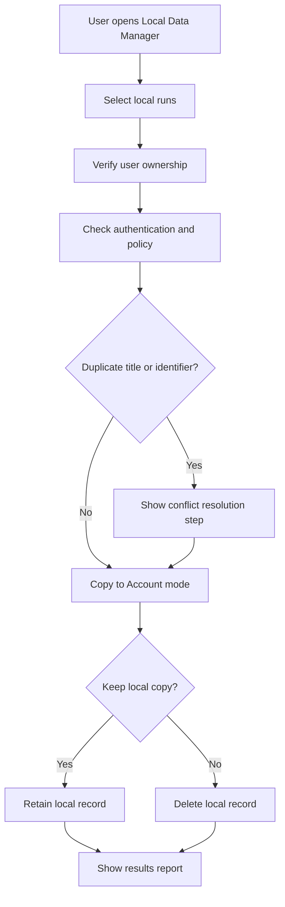

The conversion flow must explicitly verify ownership before copying local data into an authenticated account.

### 10.3 Skill Autocomplete Flow

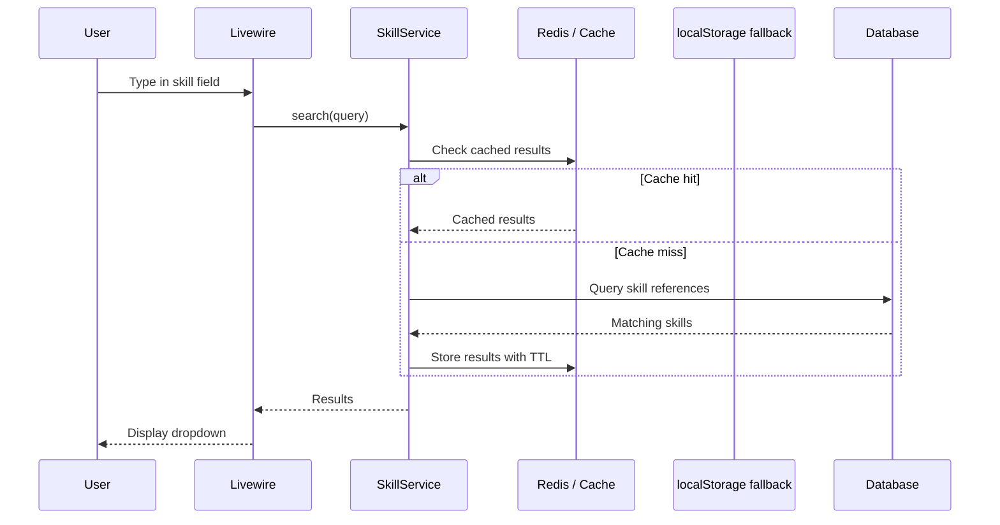

Caching strategy:

- Primary cache: server-side cache / Redis for normal online use.
- Secondary fallback: a small static list or browser cache for offline mode and repeat lookups.
- The UI should continue to work when the network is unavailable, even if search precision is reduced.

---

## 11. Testing Strategy

### 11.1 Test Layers

| Layer | Purpose | Tooling |
| --- | --- | --- |
| Unit | Validate pure logic and edge cases | PHPUnit |
| Feature | Validate Livewire and HTTP behavior | PHPUnit + Laravel test helpers |
| E2E | Validate key user journeys | Playwright |
| Accessibility | Validate keyboard and contrast behavior | Playwright accessibility checks |

### 11.2 `data-testid` Strategy

- Add stable `data-testid` attributes to interactive controls, summary panels, tables, modals, and important empty states.
- Use test IDs for Playwright and component tests when visible text may change.
- Keep the naming consistent across view modes so the same selectors can be reused in Local and Account flows.

### 11.3 Core E2E Flows

- Dashboard render and plan list interaction.
- Quick create of a Local plan and redirect to the UUID route.
- Edit and save of Account and Local plans.
- Skill autocomplete and skill row updates.
- Import preview, conflict resolution, and final execution.
- Local data purge and local-to-account conversion.

### 11.4 Accessibility Checks

- Confirm keyboard navigation across tabs, menus, modals, and tables.
- Verify visible focus states.
- Validate toast announcements and ARIA labelling.
- Run accessibility checks when UI color tokens or component structures change.

---

## 12. Third-Party Libraries

| Package | Version | Purpose | Notes |
| --- | --- | --- | --- |
| `laravel/framework` | `^12.0 || ^13.0` | Application framework | Core backend stack. |
| `livewire/livewire` | `^3.6` | Server-driven UI reactivity | Primary UI state layer. |
| `laravel/sanctum` | `^4.2` | Authentication | Used for authenticated sessions and API auth. |
| `laravel/tinker` | `^2.10.1` | Interactive debugging | Development-only. |
| `laravel/boost` | `^1.1` | Boost tooling | Development and assistant support. |
| `laravel/pint` | `^1.24` | Code formatting | Development-only. |
| `laravel/sail` | `^1.41` | Containerized development | Development-only. |
| `larastan/larastan` | `3.6.1` | Static analysis | Development-only. |
| `phpunit/phpunit` | `^11.5.3` | Test framework | Primary automated testing framework. |
| `tailwindcss` | `^4.0.0` | Styling | Utility-first CSS framework. |
| `vite` | `^7.0.4` | Asset bundling | Frontend build tooling. |
| `alpinejs` | `^3.15.3` | Micro-interactions | Used for lightweight browser interactions. |
| `sweetalert2` | `^11.23.0` | Dialog and alert UI | Used where richer confirmations are needed. |
| `@playwright/test` | `^1.55.0` | E2E testing | Browser automation and accessibility checks. |
| `@axe-core/playwright` | `^4.11.0` | Accessibility testing | Automated a11y assertions in Playwright. |
| `maatwebsite/excel` | Not installed | Spreadsheet import/export | Not currently in `composer.json`; spreadsheet workflows are handled in-app or via CSV/JSON adapters. |

---

## 13. Appendices

### 13.1 Canonical Field Names Reference

| UI Label | Canonical Field | Notes |
| --- | --- | --- |
| Plan / Career Run ID | `id` | Numeric Account identifier. |
| Local Plan UUID | `local_uuid` / `uuid` | Browser-local identifier. |
| Storage Mode | `storage_mode` | `local` or `account`. |
| Career Stage | `career_stage` | Junior, Classic, Senior. |
| Current Turn | `turn_before` / `current_turn` | Implementation naming depends on layer. |
| Turn Number | `turn_number` | Used by turn records and snapshots. |
| SP Balance | `total_available_skill_points` / `total_sp_available` | Keep names consistent across adapters. |
| Stamina % | `stamina_percentage` | Integer percentage. |
| Energy | `energy` | Training state indicator. |
| Mood | `mood` | UI-facing status label or lookup reference. |
| Conditions | `conditions` | Serialized condition list or label. |
| Strategy | `strategy` / `strategy_id` | Model-backed lookup or enum mapping. |
| Notes | `notes` | Free-text plan notes. |
| Image Path | `image_path` / `trainee_image_path` | File or asset reference. |
| Race Name | `race_name` | Prediction or snapshot context. |
| Schema Version | `schema_version` | Required for local payload migration. |

### 13.2 Revision History

| Version | Date | Author | Changes |
| --- | --- | --- | --- |
| 1.0 | 2026-01-03 | System | Initial draft. |
| 2.0 | 2026-01-03 | System | Markdown conversion and Mermaid diagrams. |
| 3.0 | 2026-07-03 | System | Added architecture detail, security/performance/logging/testing sections, and updated model/service design. |
