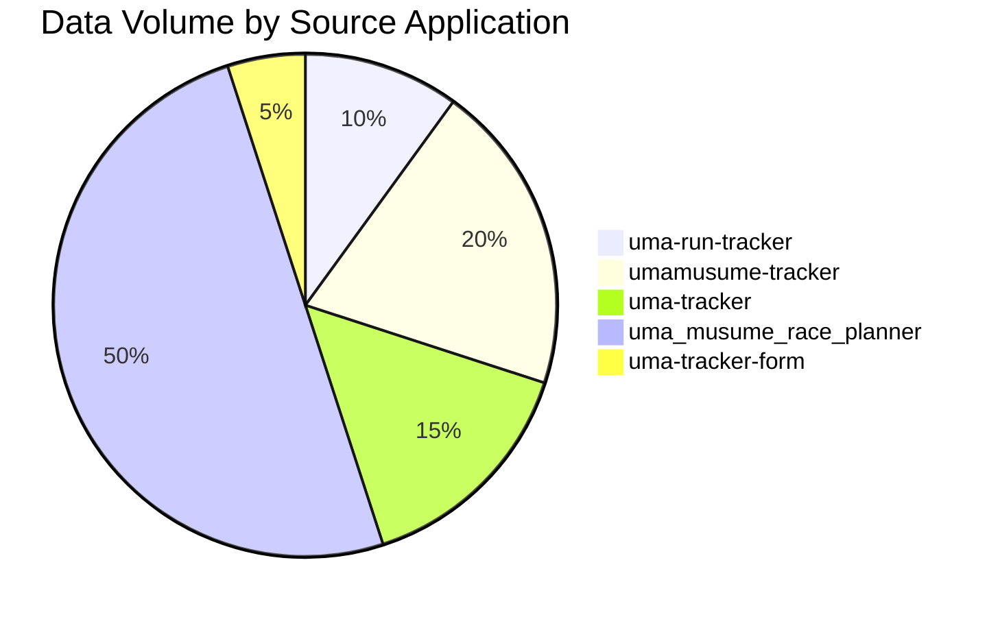
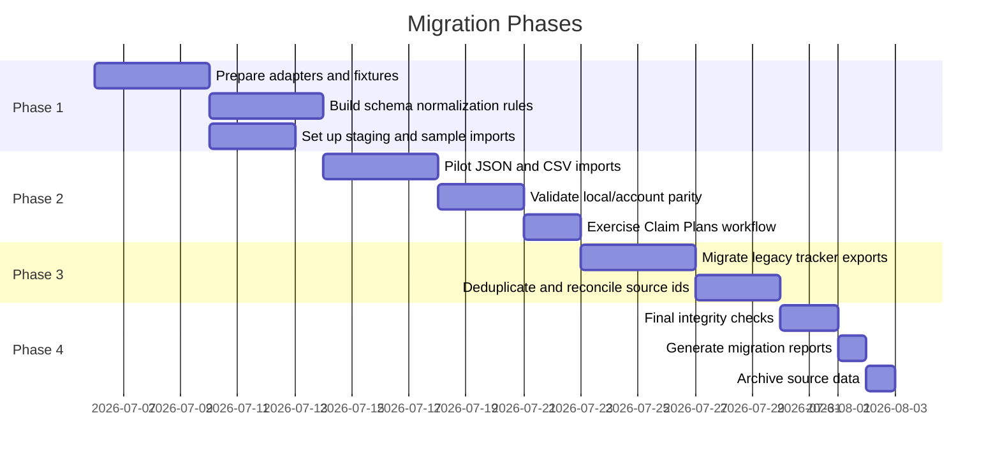
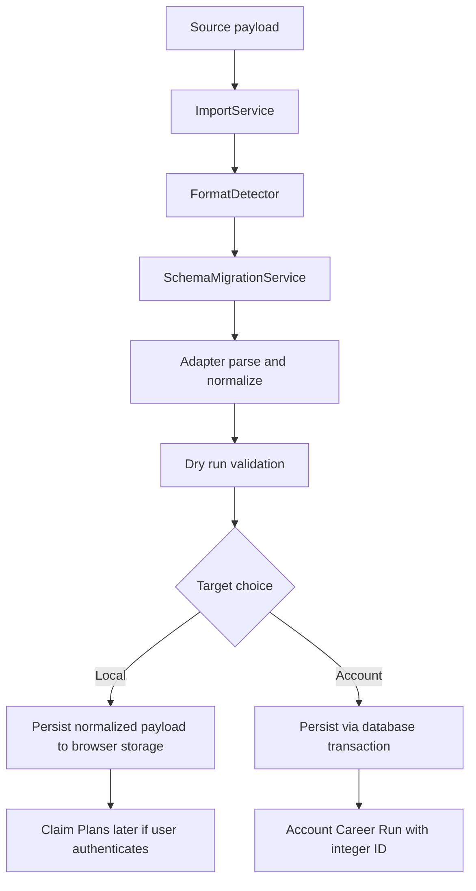
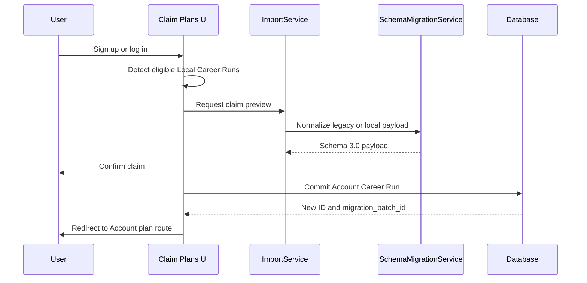
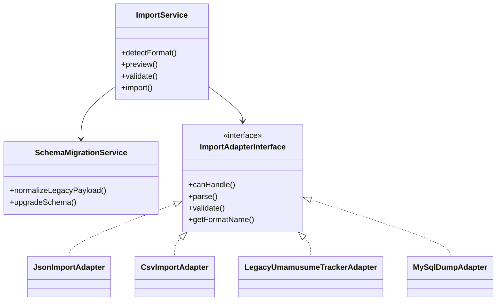
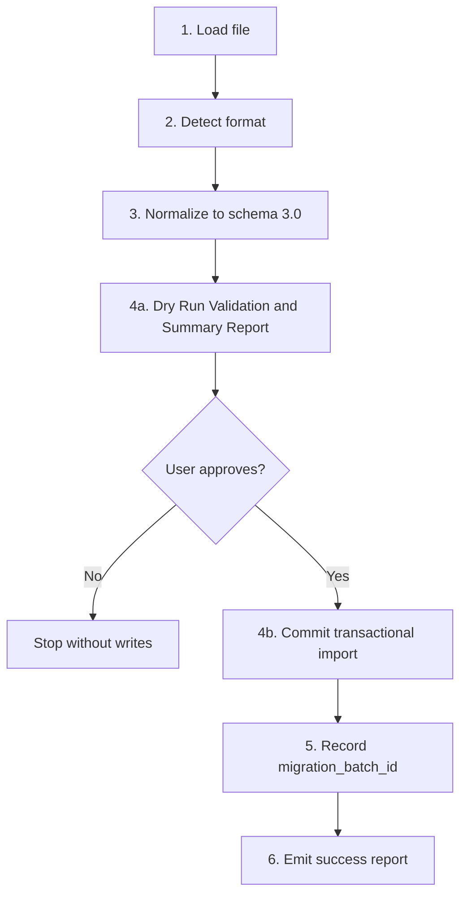
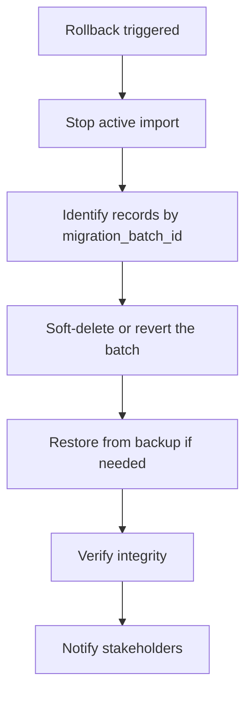
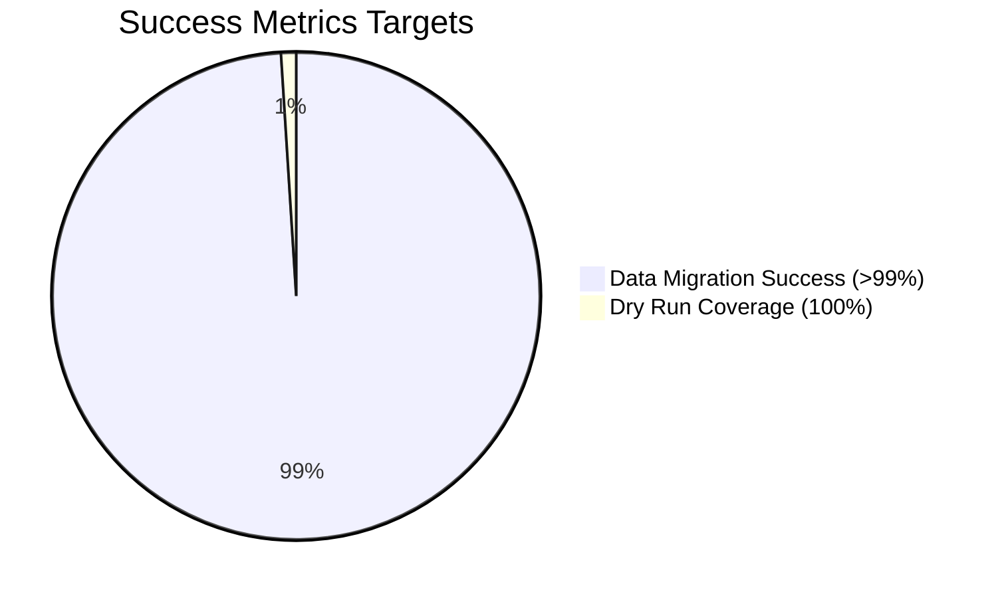

# D05 - Data Migration Plan

## Uma Musume Career Planner

**Document Version:** 3.0
**Date:** 2026-07-03
**Status:** Active
**Last Updated:** 2026-07-03

---

## Table of Contents

1. [Executive Summary](#1-executive-summary)
2. [Source System Analysis](#2-source-system-analysis)
3. [Target System Schema](#3-target-system-schema)
4. [Migration Strategy](#4-migration-strategy)
5. [Import Adapters](#5-import-adapters)
6. [Data Transformation Rules](#6-data-transformation-rules)
7. [Conflict Resolution](#7-conflict-resolution)
8. [Migration Execution Plan](#8-migration-execution-plan)
9. [Rollback Procedures](#9-rollback-procedures)
10. [Communication Plan](#10-communication-plan)
11. [Success Metrics](#11-success-metrics)
12. [Appendices](#12-appendices)

---

## 1. Executive Summary

This plan defines the migration approach for the Uma Musume Career Planner as of July 2026. It supersedes the older database-only draft and treats migration as a dual-storage problem: every import must be valid for both Local storage (`storage_mode = local`) and Account storage (`storage_mode = account`).

Career Run is the business-facing concept. Plan is the implementation record used by the Laravel application, services, and data pipeline. The migration layer must preserve both terms in the right places and keep the user experience stable across browser-backed and database-backed data.

### 1.1 Migration Scope

| Source Application | Legacy Format | Primary Adapter Target | Storage Modes Supported |
| --- | --- | --- | --- |
| uma-run-tracker | JSON / localStorage export | JsonImportAdapter | local, account |
| umamusume-tracker | JSON / API export | LegacyUmamusumeTrackerAdapter | local, account |
| uma-tracker | CSV / SQLite / MySQL export | CsvImportAdapter | local, account |
| uma_musume_race_planner | MySQL dump / JSON export | MySqlDumpAdapter | local, account |
| uma-tracker-form | CSV / JSON export | CsvImportAdapter | local, account |

### 1.2 Migration Objectives

1. Preserve all user data from legacy applications without changing the user-visible Career Run meaning.
2. Maintain source identifiers in `source_metadata` so every imported record can be traced back to its origin.
3. Support incremental, deduplicated migrations so repeated imports do not create duplicate Career Runs.
4. Support both Local and Account destinations, including later Claim Plans conversion from Local to Account.
5. Validate imports with a dry run before any committed writes occur.
6. Provide transactional rollback keyed by `migration_batch_id`.

### 1.3 Claim Plans Scope

Claim Plans is the workflow that converts a Local Career Run into a permanent Account Career Run after sign-up or log-in. The flow is required by BR-11.3 and REQ-AUTH-1.3 and must behave as follows:

- An unauthenticated user can import or create a Local Career Run.
- When the user later authenticates, the UI can present Claim Plans for eligible Local runs.
- The claim operation replays the already-normalized Local payload into Account storage, assigns a database ID, and preserves the original UUID in `source_metadata`.
- If authentication is not available, the claim flow is deferred instead of blocked.

---

## 2. Source System Analysis

### 2.1 Legacy Sources

| Source Application | Native Shape | Typical Export | Migration Notes |
| --- | --- | --- | --- |
| uma-run-tracker | Versioned JSON in browser storage | JSON | Best structured source; often already close to canonical fields. |
| umamusume-tracker | Laravel / React JSON | JSON | May need bilingual character and skill reconciliation. |
| uma-tracker | Laravel / Blade persistence | CSV, SQLite, MySQL | Often requires row-to-entity decomposition. |
| uma_musume_race_planner | PHP / MySQL | SQL dump, JSON | Legacy source IDs should be preserved in `source_metadata`. |
| uma-tracker-form | Flat form-based data | CSV, JSON | Usually needs schema inference and null-safe transforms. |

### 2.2 Source Matching Principles

Every source is normalized through the same pipeline:

1. Detect file format and legacy schema version.
2. Parse the payload into a canonical import shape.
3. Normalize fields to schema version `3.0`.
4. Resolve entities against the target roster and skill catalogs.
5. Run a dry validation pass.
6. Commit only after duplicate resolution and batch confirmation.

### 2.3 Entity Matching Matrices

#### 2.3.1 Character Matching

| Legacy Value | Target Lookup | Decision Rule |
| --- | --- | --- |
| English `name` | `characters.name` | Exact match first, then normalized match ignoring case, spaces, punctuation, and common hyphen variants. |
| Japanese `name_jp` | `characters.name_jp` | Exact JP match wins when present. |
| Both names available | `characters.name`, `characters.name_jp` | Prefer the exact language-specific match for the source payload. |
| Multiple matches | Character catalog | Mark as ambiguous, attach the candidate IDs to `source_metadata`, and require manual selection. |
| No match | Character catalog | Create a reviewable import warning and preserve the raw source name in `source_metadata`. |

#### 2.3.2 Skill Matching

| Legacy Value | Target Lookup | Decision Rule |
| --- | --- | --- |
| English skill name | `skills.name` | Exact English match first. |
| Japanese skill name | `skills.name_jp` | Exact JP match first. |
| Either language | `skills.name` / `skills.name_jp` | Normalize for punctuation and whitespace before fallback matching. |
| Three-state status | `skill_career_runs.status` | Normalize to `acquired`, `skipped`, or `suggested`. |
| Duplicate skill names | Skill catalog | Resolve by `name + name_jp + tier + sp_cost` before prompting. |

#### 2.3.3 Timeline Mapping

| Legacy Indicator | Canonical Career Stage | Notes |
| --- | --- | --- |
| `year: 1` | `junior` | First-year training phase. |
| `year: 2` | `classic` | Middle-year training phase. |
| `year: 3` | `senior` | Final-year training phase. |

---

## 3. Target System Schema

### 3.1 Schema Version

Target migration schema version: `3.0`

All imported payloads must be normalized to schema `3.0` before they are committed. If the incoming payload is `schema_version: "1.0"` or missing a version entirely, the import pipeline must treat it as legacy input and upgrade it through `SchemaMigrationService` before any writes occur.

### 3.2 Canonical Field Catalog

| Entity | Canonical Fields |
| --- | --- |
| Career Run | `id`, `uuid`, `user_id`, `storage_mode`, `title`, `status`, `career_stage`, `current_turn`, `total_sp_available`, `stamina_percentage`, `mood`, `conditions`, `energy`, `strategy`, `notes`, `image_path`, `source_metadata` |
| Stat Progress | `career_run_id`, `turn_number`, `speed`, `stamina`, `power`, `guts`, `wit` |
| Skill Career Run | `career_run_id`, `skill_id`, `status`, `turn_acquired`, `sp_cost`, `notes`, `source_metadata` |
| Character | `id`, `name`, `name_jp`, `image_path`, `source_metadata` |
| Race Prediction | `career_run_id`, `race_name`, `venue`, `distance`, `track`, `turn_number`, `notes`, `source_metadata` |
| Goal | `career_run_id`, `description`, `completed`, `completion_date`, `source_metadata` |
| Activity Log | `user_id`, `model_type`, `model_id`, `action`, `source_metadata` |

### 3.3 `source_metadata` Contract

`source_metadata` is the durable traceability layer for every imported record. It should carry the original source identifiers and import context rather than discarding them during normalization.

Minimum recommended keys:

- `source_application`
- `source_schema_version`
- `source_record_id`
- `source_parent_id`
- `source_uuid`
- `import_batch_id`
- `imported_at`
- `import_hash`
- `claim_status`
- `legacy_payload`

### 3.4 Schema Upgrade Rules

| Legacy Input | Normalized Output |
| --- | --- |
| `schema_version: "1.0"` | Upgrade to `3.0` and map old keys to canonical keys. |
| `total_sp` / `sp_available` | `total_sp_available` |
| `stamina_pct` | `stamina_percentage` |
| `turn` / `current_turn` | `current_turn` and `turn_number` as appropriate |
| `status: ongoing` | `status: in_progress` |
| `status: done` | `status: completed` |
| `year: 1/2/3` | `career_stage: junior/classic/senior` |

---

## 4. Migration Strategy

### 4.1 Phased Approach

### 4.2 Migration Methods

### 4.3 Claim Plans Flow

Claim Plans must preserve the original Local UUID in `source_metadata` and record the claim event so the source can be audited later.

---

## 5. Import Adapters

### 5.1 Architecture

### 5.2 Adapter Matrix

| Adapter | Production Target | Status | Notes |
| --- | --- | --- | --- |
| JsonImportAdapter | P0 | Implemented | Primary structured JSON import path for current and legacy browser exports. |
| CsvImportAdapter | P0 | Implemented | General-purpose CSV import path for spreadsheet-style exports. |
| LegacyUmamusumeTrackerAdapter | P1 | Planned | Detects formatted legacy payloads and reconciles them into schema `3.0`. |
| MySqlDumpAdapter | P2 | Post-MVP | Handles raw SQL dumps from database-backed legacy applications. |

### 5.3 Schema Migration Service Behavior

`SchemaMigrationService` is the normalization layer between raw legacy content and the canonical import model. Its contract is:

1. Detect whether the payload is already schema `3.0`.
2. Detect legacy payloads such as `schema_version: "1.0"` or unversioned JSON.
3. Upgrade renamed fields and enum values to canonical form.
4. Preserve original values in `source_metadata.legacy_payload` when fidelity matters.
5. Return a safe `3.0` payload that downstream validation can process consistently.

---

## 6. Data Transformation Rules

### 6.1 Field Mappings

| Source Field | Canonical Field | Rule |
| --- | --- | --- |
| `run_id` | `uuid` | Generate a new UUID for Local imports and preserve the source ID in `source_metadata`. |
| `id` | `id` | Keep the database integer ID for Account writes when safe and permitted. |
| `storage_mode` | `storage_mode` | Normalize to `local` or `account` only. |
| `total_sp`, `sp_available` | `total_sp_available` | Direct copy after numeric normalization. |
| `stamina_pct` | `stamina_percentage` | Convert legacy percentage field names to the canonical field. |
| `turn`, `turn_before` | `current_turn`, `turn_number` | Use `current_turn` for the active run pointer and `turn_number` for stat history rows. |
| `year: 1/2/3` | `career_stage` | Map to `junior`, `classic`, `senior`. |
| `status` | `status` | Normalize to the three-state layout: `acquired`, `skipped`, `suggested`. |
| `mood` | `mood` | Preserve or map to the canonical mood vocabulary used by the app. |
| `conditions` | `conditions` | Keep as the normalized condition set. |
| `energy` | `energy` | Carry forward as the current energy value. |
| `strategy` | `strategy` | Map legacy race strategy labels to the canonical strategy enum. |
| `notes` | `notes` | Preserve freeform notes and trim invalid control characters. |
| `image_path` | `image_path` | Copy the stored reference; never rewrite the path without a storage-specific rule. |

### 6.2 Career Run Transformations

| Legacy Pattern | Canonical Output | Notes |
| --- | --- | --- |
| Local UUID export | `storage_mode = local` | Keep UUID routing for browser-backed data. |
| Authenticated import | `storage_mode = account` | Use integer ID routing after commit. |
| Missing `source_metadata` | Create it | Always attach source provenance. |
| Duplicate source record | Mark for dedupe | Do not auto-create a second Career Run. |

### 6.3 Skill Status Transformations

| Legacy Value | Canonical Status |
| --- | --- |
| `bought`, `purchased`, `true` | `acquired` |
| `skipped`, `passed`, `false` | `skipped` |
| `planned`, `suggested`, `maybe` | `suggested` |

### 6.4 Validation Rules

| Field | Rule |
| --- | --- |
| `title` | Required, trimmed, max 255 characters. |
| `storage_mode` | Required, must be `local` or `account`. |
| `career_stage` | Required, must be `junior`, `classic`, or `senior`. |
| `current_turn` | Required, integer 1 to 78. |
| `turn_number` | Required for stat history rows, integer 1 to 78. |
| `stamina_percentage` | Integer 0 to 100. |
| `total_sp_available` | Integer, non-negative. |
| `mood` | Controlled vocabulary only. |
| `conditions` | Controlled set of game-specific conditions. |
| `energy` | Integer, non-negative. |
| `notes` | Optional text, sanitised and length-limited. |
| `image_path` | Must be a valid reference for the active storage mode. |

---

## 7. Conflict Resolution

### 7.1 Duplicate Signatures

Duplicates are detected with a multi-key signature instead of a single field match.

| Signature | Purpose |
| --- | --- |
| `Character + Title + Storage Mode` | Primary dedupe key for Career Runs. |
| `Character + Title + Storage Mode + Career Stage` | Secondary key when the same title is reused across stages. |
| `Source Application + Source Record ID` | Prevents re-importing the same legacy record. |
| `Storage Mode + Local UUID` | Protects Local imports from being cloned accidentally. |
| `Character + Skill + Turn Acquired` | Skill-level dedupe for imported skill rows. |

### 7.2 Dry Run Architecture

The execution pipeline must include an explicit dry-run stage before any committed insert or update.

Dry-run output should include:

- record counts by entity
- duplicate signatures found
- ambiguous character and skill matches
- invalid rows and field-level errors
- storage mode distribution
- estimated records that will be claimed later through Claim Plans

### 7.3 Resolution Options

| Option | Behavior |
| --- | --- |
| Skip | Keep the existing record and ignore the imported duplicate. |
| Overwrite | Replace the existing record when the user explicitly approves it. |
| Import as Copy | Create a new record with a modified title and a new target identifier. |
| Review Later | Park the record in a review queue when ambiguity remains. |

### 7.4 User-Safe Conflict Rules

- Never silently overwrite Account storage.
- Never merge two Character records during migration unless the user explicitly approves the operation.
- Never drop source provenance when resolving conflicts.
- Always preserve the original payload in `source_metadata` when a conflict forces a transformation.

---

## 8. Migration Execution Plan

### 8.1 Pre-Migration Checklist

- [ ] Source exports have been created and checksum-verified.
- [ ] Adapters are available for the intended source format.
- [ ] `SchemaMigrationService` normalization rules cover the detected schema versions.
- [ ] Staging data and rollback backups are available.
- [ ] The dry-run summary is reviewed by the operator.
- [ ] The maintenance window has been announced.

### 8.2 Execution Steps

| Step | Action |
| --- | --- |
| 1 | Enable maintenance mode or other import lock. |
| 2 | Create a database backup and capture the current Local export snapshot if needed. |
| 3 | Parse, normalize, and validate the incoming payload. |
| 4a | Run Dry Run Validation & Summary Report and surface conflicts before any commit. |
| 4b | Request user/operator confirmation for the final target and dedupe strategy. |
| 5 | Commit the batch using a unique `migration_batch_id`. |
| 6 | Generate the migration report and retain source provenance. |
| 7 | Disable maintenance mode and monitor for regressions. |

### 8.3 Post-Migration Verification

| Check | Verification |
| --- | --- |
| Record count matches | Compare source and target counts by entity. |
| Skill links resolve | Confirm skill reference IDs are valid. |
| Turn data complete | Check all `turn_number` records and `current_turn` values. |
| Local claimability works | Confirm eligible Local runs can be claimed into Account storage. |
| Source identifiers retained | Inspect `source_metadata` for imported identifiers. |
| No orphan rows | Verify parent-child relationships after import. |

---

## 9. Rollback Procedures

### 9.1 Rollback Triggers

- Data corruption is detected after import.
- Validation failures exceed acceptable thresholds.
- Critical plan data is missing or mapped incorrectly.
- Claim Plans conversion breaks Local-to-Account continuity.
- Users report unrecoverable data loss.

### 9.2 Rollback Steps

### 9.3 Rollback Window

- Full rollback: within 24 hours of the import window.
- Batch-level soft delete recovery: available while the `migration_batch_id` is retained.
- Individual record reversal: allowed when source provenance remains intact.

### 9.4 Self-Service Reversion

If the target system supports user-facing reversion, the migration batch must remain identifiable so an operator can reverse only the imported batch without affecting unrelated Career Runs.

---

## 10. Communication Plan

### 10.1 Stakeholder Notifications

| Phase | Recipients | Message |
| --- | --- | --- |
| T-7 days | All users | Migration announcement and scope summary. |
| T-1 day | All users | Reminder with import and claim guidance. |
| T-0 | All users | Maintenance notice and import lock window. |
| T+1 hour | All users | Import complete and claim instructions. |
| T+24 hours | All users | Follow-up, feedback request, and support link. |

### 10.2 Support Plan

- FAQ document prepared for import and claim flows.
- Support team briefed on storage mode differences.
- Known issues and duplicate-resolution cases documented.
- Escalation path defined for claim or rollback failures.

---

## 11. Success Metrics

### 11.1 Migration KPIs

| Metric | Target |
| --- | --- |
| Data migration success rate | > 99% |
| Dry-run validation coverage | 100% of imported batches |
| Duplicate false positives | < 1% |
| Source metadata retention | 100% |
| Claim Plans success rate | > 95% for eligible Local runs |
| Downtime duration | < 2 hours |

### 11.2 Data Integrity Metrics

| Check | Threshold |
| --- | --- |
| Record count accuracy | 100% |
| Field mapping accuracy | > 99% |
| Relationship integrity | 100% |
| Schema compliance | 100% |
| Bilingual match accuracy | > 99% for exact-name matches |

---

## 12. Appendices

### 12.1 Related Documents

- [D02_Business_Requirements_Specifications.md](D02_Business_Requirements_Specifications.md)
- [D03_System_Requirements_Specifications.md](D03_System_Requirements_Specifications.md)
- [D04_System_Design_Specifications.md](D04_System_Design_Specifications.md)
- [D06_Data_Migration_Specifications.md](D06_Data_Migration_Specifications.md)

### 12.2 Revision History

| Version | Date | Author | Changes |
| --- | --- | --- | --- |
| 1.0 | 2026-01-03 | System | Initial draft. |
| 2.0 | 2026-01-03 | System | Converted to markdown and added Mermaid diagrams. |
| 3.0 | 2026-07-03 | System | Updated for dual-storage architecture, schema 3.0, source metadata, and Claim Plans flow. |
