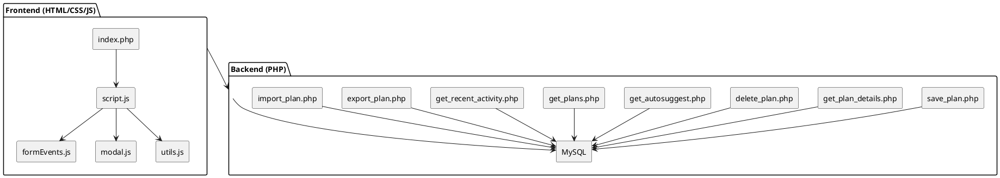

# SPEC-1-uma-planner

## Background

The Uma Musume Race Planner is a lightweight, client-hosted web tool that enables users to manually input and track turn-based training plans inspired by Uma Musume. These plans include stat development, skills, goals, race predictions, and affinities. Users can build detailed strategies across a trainee's entire career cycle and leverage autosuggestions based on past entries. With no user authentication, the app is tailored for single-player use, enabling fast access and management of planning data.

---

## Requirements

### Must Have

- Store detailed training plans including stats, skills, goals, predictions, terrain and strategy metadata
- Support autosuggestions for race names, skills, conditions, and goals
- Allow users to create, edit, delete, and view plans
- Autosave timestamps and show recent activity log
- No login or registration
- Clean and responsive frontend using Bootstrap 5

### Should Have

- Field validation (e.g., required fields, proper enums)
- Search/filter through saved plans
- Ability to display race prediction evaluations

### Could Have

- Export/import functionality (e.g., JSON)
- Tag or label color highlighting for skills
- Stat visualizations (e.g., growth graphs)

### Won’t Have (MVP)

- User authentication or cloud sync
- Real-time multiplayer editing

---

## Method

### Architecture Overview



**Backend Behavior**

* `get_autosuggest.php` accepts `term` and `type`
* Only whitelisted fields are allowed: `skill_name`, `race_name`, `name`, `goal`
* Excludes soft-deleted plans from results
* Queries the appropriate table and column using `LIKE ?%` pattern with indexed columns
* Returns up to 10 unique matches in JSON format

---

#### 📋 Plan View + Edit

* Plans are rendered dynamically in `index.php`
* Modal (`modal-plan.php`) shows full details when clicked
* Supports editing acquired status, fields, and skills
* Edits submitted via AJAX to `save_plan.php`

---

#### 🕒 Recent Activity

* Displayed via `recent-activity.php`
* Fetches the 5–10 most recent plans (`created_at DESC`)
* Includes status-based icons (e.g., `New`, `Updated`, `Finished`)
* Useful for navigation and tracking plan history

---

#### 🔍 Search & Filter Panel

**Frontend Behavior**

* Bootstrap-based form sits above the plan list
* Supports filtering by:

  * Keyword (race name or character)
  * Status (`Planning`, `Finished`)
  * Minimum stat thresholds (e.g., SPEED > 500)
  * Goal outcome (e.g., `TOP 3`, `1ST`)

**Backend Behavior**

* `get_plans.php` builds SQL filters based on request
* Supports `LIKE`, subquery stat thresholds, and goal filtering
* Excludes plans marked as soft-deleted (`deleted_at IS NULL`)
* Returns JSON list of matched plans

---

#### 🗑️ Soft Delete Support

* Plans are never permanently deleted
* `delete_plan.php` sets `deleted_at = NOW()` for soft deletion
* All views (list, autosuggest, export, get details) exclude soft-deleted plans
* Data remains in database for potential future restoration

---

#### 🏷️ Tagging and Color Labeling for Skills

**Frontend Behavior**

* Each skill row in the modal includes a tag dropdown (e.g., `Passive`, `Burst`, `Recovery`, `Strategy`, `Unique`)
* On plan save, the selected tag is stored with each skill

**Backend Behavior**

* `skills` table includes a `tag` column (`VARCHAR(50)`)
* `save_plan.php` saves the tag alongside each skill
* `get_plan_details.php` returns it for rendering

**Display Behavior**

* Skill tags are shown as Bootstrap badges:

| Tag      | Color Badge Class |
| -------- | ----------------- |
| Passive  | `badge-secondary` |
| Burst    | `badge-danger`    |
| Recovery | `badge-success`   |
| Strategy | `badge-info`      |
| Unique   | `badge-warning`   |

* Example:

```html
Final Push <span class="badge bg-danger">Burst</span>
```

---

## Implementation

### 1. Frontend Setup

* Create layout in `index.php` using Bootstrap 5
* Include reusable components (navbar, modal, etc.)
* Hook interactive logic via JS modules

### 2. Backend API Integration

* `save_plan.php`: Handles insert/update for plans and sub-tables
* `get_plan_details.php`: Returns full plan object for modal/view
* `delete_plan.php`: Soft-deletes plan via `deleted_at`
* `get_autosuggest.php`: Fetches suggestion results
* `get_plans.php`: Applies dynamic filters and excludes soft-deleted plans
* `export_plan.php` / `import_plan.php`: Handles full JSON export/import

### 3. Database Setup

* Run `uma_musume_planner.sql`
* Ensure these schema changes:

```sql
ALTER TABLE skills ADD COLUMN tag VARCHAR(50) DEFAULT NULL;
ALTER TABLE plans ADD COLUMN deleted_at DATETIME DEFAULT NULL;
```

* Index key fields for autosuggest and filtering

### 4. UX Enhancements

* Client-side validation for key fields
* Debounced autosuggest on supported fields
* Plan modals for inline edit/view
* Filter panel for search + stat threshold filtering
* JSON export/import via file picker
* Skill tags rendered as Bootstrap badges
* Recent activity icons reflect action type

---

## Milestones

* ✅ Project Setup and SQL schema finalized
* ✅ Frontend layout with Bootstrap and component wiring
* ✅ Basic CRUD for plans
* ✅ Autosuggestion logic completed
* ✅ Search & filter panel
* ✅ JSON export/import support
* ✅ Tagging and color labels for skills
* ✅ Soft delete support
* ⏳ Visualization features (stats over time)

---

## Gathering Results

* ✅ Confirm database saves and relations via phpMyAdmin
* ✅ Evaluate autosuggest performance under \~500 entries
* ✅ Verify soft-delete propagation across views and export
* ✅ Filter panel verified for goal/stat-based queries
* ✅ Tag display correctly shown and stored
* ✅ Recent activity shows icon based on plan status
* ⏳ Gather user feedback for future analytics/charts